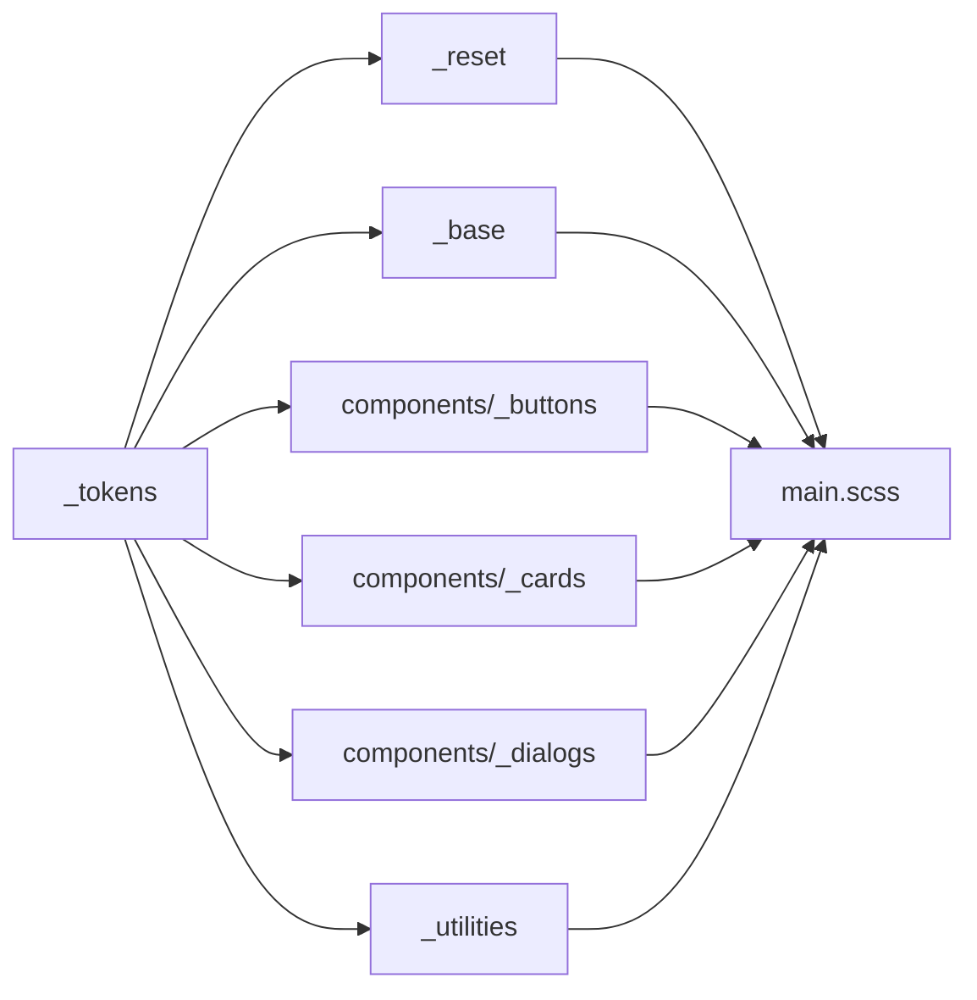

# CSS 样式统一重构方案

> 参考模板: `template-css` (D:\4-softworkspace\myJs\chenxing\template-css)  
> 目标项目: CombatDebugStudio (D:\4-softworkspace\java\CombatDebugStudio)  
> 状态: **设计稿 / 待实施**

---

## 1. 现状分析

### 1.1 当前文件分布

| 文件 | 行数 | 类型 | 问题 |
|------|------|------|------|
| `src/presentation/styles/global.css` | 326 | 纯 CSS | 绝大部分是 reset，末尾 `:root` 定义了 15 个变量，但未被系统化使用 |
| `src/presentation/styles/main.scss` | 2577 | SCSS | **巨型文件**，包含布局/组件/动画/字体全部混合，所有颜色值硬编码 |
| 28 个 `.vue` 文件 | — | SFC | 部分含 `<style scoped>`，可能也在使用硬编码值 |

### 1.2 硬编码值散布情况

`main.scss` 中至少出现 5 次以上的核心色值:

| 色值 | 语义 | 出现次数(约) |
|------|------|:---:|
| `#1a1a2e` | 主背景 | 40+ |
| `#0f3460` | 边框/次要背景 | 100+ |
| `#e94560` | 强调色(危险/标题) | 20+ |
| `#4fc3f7` | 信息色(按钮/链接) | 30+ |
| `#16213e` | 面板标题背景 | 15+ |
| `#0f0f1a` | 深色卡片背景 | 20+ |
| `#888` / `#666` | 次要/禁用文本 | 30+ |

**根因**: 没有一个「单一事实来源」(Single Source of Truth)，修改主题色需要全文搜索替换，极易遗漏。

### 1.3 与 template-css 的差距

```
层级               template-css                   本项目现状
────────────────────────────────────────────────────────────
设计令牌(Design Token)  tokens.css ✅                  global.css 末尾 15 个变量 ❌ 不完整
全局基础(Base)          base.css ✅                    global.css 等同于 base.css 但无 tokens 引用
组件样式(Component)      buttons.css / cards.css ✅     main.scss 内混写 ✅ 但有但无拆分
原子工具(Utilities)     utilities.css ✅               不存在，到处重复 `display:flex;gap:Xrem` ❌
主题切换(Theme)         :root[data-theme="light"] ✅   不支持 ❌
索引页/Demo             index.html ✅                  不存在 ❌
```

---

## 2. 目标架构

### 2.1 文件结构

```
src/presentation/styles/
├── _tokens.scss              # ① 设计令牌（SCSS 变量 + CSS 自定义属性）
├── _reset.scss               # ② 全局 reset（从 global.css 精简）
├── _base.scss                # ③ 全局基础排版、滚动条、焦点
├── _utilities.scss           # ④ 原子工具类
├── components/
│   ├── _buttons.scss         # 按钮体系
│   ├── _cards.scss           # 卡片体系
│   ├── _dialogs.scss         # 弹窗体系
│   ├── _notifications.scss   # 通知体系
│   └── _replay.scss          # 回放相关
├── main.scss                 # ⑤ 仅 @import 以上所有（保持干净）
└── index.html                # ⑥ 样式展示页（非必需，推荐）
```

> **关于 `_variables.scss`**: template-css 方案中建议了一个 `_variables.scss`。考虑到本项目使用 SCSS 且已有 `main.scss`，SCSS 变量统一放在 `_tokens.scss` 中即可，不额外增加文件。

### 2.2 依赖顺序



HTML 引入顺序：

```html
<link rel="stylesheet" href="styles/tokens.css" />
<link rel="stylesheet" href="styles/reset.css" />
<link rel="stylesheet" href="styles/base.css" />
<link rel="stylesheet" href="styles/components/buttons.css" />
<link rel="stylesheet" href="styles/components/cards.css" />
<!-- ... -->
<link rel="stylesheet" href="styles/utilities.css" />
```

---

## 3. `_tokens.scss` 设计（核心）

### 3.1 色板提取（从现有配色反推）

```scss
// ===== 品牌色系 =====
$brand-colors: (
  'primary':   #1a1a2e,   // 主背景
  'secondary': #0f3460,   // 边框/次要
  'accent':    #e94560,   // 强调/危险
  'info':      #4fc3f7,   // 信息/链接
  'success':   #4caf50,   // 成功
  'warning':   #ff9800,   // 警告
  'danger':    #f44336,   // 错误
);

// ===== 中性色板 =====
$neutral-colors: (
  'bg-primary':     #1a1a2e,
  'bg-secondary':   #0f0f1a,
  'bg-tertiary':    #16213e,
  'text-primary':   #ffffff,
  'text-secondary': #888888,
  'text-muted':     #666666,
  'text-disabled':  #444444,
  'border':         #0f3460,
  'border-hover':   #1a4a7a,
  'border-focus':   #4fc3f7,
);
```

### 3.2 CSS 自定义属性输出

```scss
:root {
  // 品牌色
  --color-primary: #1a1a2e;
  --color-secondary: #0f3460;
  --color-accent: #e94560;
  --color-info: #4fc3f7;
  --color-success: #4caf50;
  --color-warning: #ff9800;
  --color-danger: #f44336;

  // 中性色
  --bg-primary: #1a1a2e;
  --bg-secondary: #0f0f1a;
  --bg-tertiary: #16213e;
  --bg-hover: #1a2a4e;
  --bg-active: #1a4a7a;

  --text-primary: #ffffff;
  --text-secondary: #888888;
  --text-muted: #666666;
  --text-disabled: #444444;

  --border-default: #0f3460;
  --border-hover: #1a4a7a;
  --border-focus: #4fc3f7;

  // 字体
  --font-family: 'Consolas', 'Monaco', 'Courier New', monospace;
  --font-size-xs: 0.65rem;
  --font-size-sm: 0.75rem;
  --font-size-base: 0.85rem;
  --font-size-md: 1rem;
  --font-size-lg: 1.4rem;

  // 间距 (4px 栅格)
  --space-1: 0.25rem;
  --space-2: 0.5rem;
  --space-3: 0.75rem;
  --space-4: 1rem;
  --space-5: 1.5rem;
  --space-6: 2rem;
  --space-8: 3rem;

  // 圆角
  --radius-sm: 3px;
  --radius-md: 4px;
  --radius-lg: 6px;
  --radius-xl: 8px;
  --radius-full: 9999px;

  // 阴影
  --shadow-sm: 0 1px 2px rgba(0,0,0,0.3);
  --shadow-md: 0 4px 6px rgba(0,0,0,0.4);
  --shadow-lg: 0 10px 40px rgba(0,0,0,0.5);
  --shadow-focus: 0 0 0 2px var(--color-info);

  // 层级
  --z-header: 100;
  --z-dropdown: 1000;
  --z-overlay: 1300;
  --z-modal: 1400;
  --z-toast: 1500;

  // 过渡
  --transition-fast: 150ms ease;
  --transition-base: 250ms ease;
  --transition-slow: 350ms ease;
}
```

---

## 4. 组件样式设计方案

### 4.1 按钮体系（参照 template-css buttons.css）

```scss
.btn {
  display: inline-flex;
  align-items: center;
  justify-content: center;
  gap: var(--space-2);
  padding: var(--space-2) var(--space-4);
  border: 1px solid var(--border-default);
  border-radius: var(--radius-md);
  background: var(--bg-secondary);
  color: var(--text-primary);
  font-family: var(--font-family);
  font-size: var(--font-size-sm);
  cursor: pointer;
  transition: all var(--transition-fast);
  user-select: none;
  white-space: nowrap;

  &:hover:not(:disabled) {
    background: var(--bg-hover);
    border-color: var(--border-hover);
  }
  &:active { background: var(--bg-active); }
  &:disabled { opacity: 0.5; cursor: not-allowed; }
  &:focus-visible {
    outline: none;
    box-shadow: var(--shadow-focus);
  }
}

// 颜色变体
.btn-primary {
  background: var(--color-accent);
  color: #fff;
  border-color: var(--color-accent);
  &:hover:not(:disabled) { background: #c62828; }
}
.btn-info {
  background: var(--color-secondary);
  color: var(--color-info);
  border-color: var(--border-default);
  &:hover:not(:disabled) {
    background: var(--bg-hover);
    border-color: var(--border-hover);
  }
}
.btn-ghost {
  background: transparent;
  color: var(--text-primary);
  border-color: transparent;
  &:hover:not(:disabled) { background: var(--bg-hover); }
}

// 尺寸变体
.btn-sm  { padding: var(--space-1) var(--space-2); font-size: var(--font-size-xs); }
.btn-lg  { padding: var(--space-3) var(--space-5); font-size: var(--font-size-base); }

// 状态修饰
.btn.is-loading { opacity: 0.8; cursor: progress; }
```

### 4.2 卡片体系

```scss
.card {
  background: var(--bg-primary);
  border: 1px solid var(--border-default);
  border-radius: var(--radius-md);
  overflow: hidden;
  box-shadow: var(--shadow-sm);
  color: var(--text-primary);
  transition: box-shadow var(--transition-base), border-color var(--transition-base);

  &--hoverable:hover {
    border-color: var(--border-hover);
    box-shadow: var(--shadow-md);
  }
}
.card-header {
  display: flex; align-items: center; justify-content: space-between;
  padding: var(--space-3) var(--space-4);
  background: var(--bg-tertiary);
  border-bottom: 1px solid var(--border-default);
}
.card-body  { padding: var(--space-4); }
.card-footer {
  display: flex; align-items: center; justify-content: flex-end;
  gap: var(--space-2);
  padding: var(--space-3) var(--space-4);
  background: var(--bg-secondary);
  border-top: 1px solid var(--border-default);
}
```

---

## 5. 迁移策略（渐进式，四阶段）

### Phase 1: 基石搭建（无破坏性）

1. 新建 `_tokens.scss`，提取当前所有硬编码值为变量
2. 新建 `_reset.scss`，从 `global.css` 精简（仅保留真正需要的 reset）
3. 新建 `_base.scss`，从 `global.css` 移出排版/滚动条/焦点样式，改为 `var()` 引用
4. 新建 `_utilities.scss`，提取 `main.scss` 中出现 5 次以上的重复片段
5. `global.css` 原文件删除（内容已被拆分）
6. `main.scss` 首行添加 `@import 'tokens';`，**不改动任何现有代码**

**验证标准**: 页面无任何视觉变化，所有现有 class 名不变。

### Phase 2: main.scss 拆分（逐步替换）

将 `main.scss` 按组件类别拆分为独立文件：

| 原区域 (main.scss 行号) | 目标文件 | 操作 |
|---|---|---|
| 布局类 (1-270, 530-570, 1470-1520) | 保留在 main.scss 或移入 `_layout.scss` | 替换硬编码为 `var()` |
| 按钮类 (41-55, 329-341, 393-410, 1493-1567) | `_buttons.scss` | 用 `.btn` 体系替换 |
| 卡片类 (586-670) | `_cards.scss` | 用 `.card` 体系替换 |
| 弹窗类 (1613-1701, 1704-1842) | `_dialogs.scss` | 统一 dialog 样式 |
| 通知类 (1990-2100) | `_notifications.scss` | 统一 notification 样式 |
| 回放类 (2103-2509) | `_replay.scss` | 独立为回放组件库 |
| 角色/场景列表 (144-215, 299-390, 2517-2566) | 保留 main.scss 或拆独立 | 替换为 var() |
| 键盘设置 (1844-1988) | `_keybind.scss` | 或保留在 main.scss |
| `@keyframes` 动画 (611-664, 1928-1938, 2018-2027, 2335-2348) | `_animations.scss` | 集中管理 |

**验证标准**: 每拆一个文件前，该区域在现有 class 名下用 `var()` 替换硬编码值后，视觉不变。

### Phase 3: Vue SFC 同步

- 对于 `<style scoped>` 中使用了硬编码值的组件，改为引用全局 `var(--xxx)` 
  - `ponytail: 只在 scoped 中写组件特有的布局/定位，颜色/间距全部走全局变量`

### Phase 4: 可选增强

- 浅色主题 `:root[data-theme="light"]` 覆盖层
- `index.html` 样式展示页
- 移除所有不再用到的旧 class

---

## 6. 关键技术决策

| 决策 | 选择 | 理由 |
|------|------|------|
| 文件格式 | **SCSS** (保留) | 项目已使用 SCSS，Vite 天然支持，不额外引入工具链 |
| 变量机制 | **CSS Custom Properties** (`var(--xxx)`) + SCSS 变量辅助计算 | CSS 变量支持运行时修改（主题切换），SCSS 变量用于循环/计算 |
| 组件 class 命名 | **BEM-like** (`.block-element--modifier`) | 与 template-css 一致，语义清晰，不依赖 CSS Modules |
| 主题切换 | `:root[data-theme="light"]` 覆盖法 | 零运行时开销，只需覆盖颜色变量，其余自然继承 |
| 迁移方式 | **渐进式替换**，不改动现有 HTML | 不破坏现有功能，可分段交付 |

---

## 7. 注意事项 / 风险

1. **SCSS `@import` 已弃用** → 使用 `@use` 和 `@forward`（Vite + sass 均支持）
2. **Vue SFC scoped style** 中 `:deep()` 穿透全局变量不受影响，只需改为 `var(--xxx)` 即可
3. **`z-index` 当前散乱**（`z-index: 100`, `1000`, `10001` 等），统一到 `--z-*` 变量后需检查叠层关系
4. **`!important` 的使用限制**，仅 `_utilities.scss` 中使用，组件库中禁止

---

## 8. 文件改动清单（最终状态）

```
ADDED:
  src/presentation/styles/_tokens.scss
  src/presentation/styles/_reset.scss
  src/presentation/styles/_base.scss
  src/presentation/styles/_utilities.scss
  src/presentation/styles/components/_buttons.scss
  src/presentation/styles/components/_cards.scss
  src/presentation/styles/components/_dialogs.scss
  src/presentation/styles/components/_notifications.scss
  src/presentation/styles/components/_replay.scss
  src/presentation/styles/components/_animations.scss
  (可选) src/presentation/styles/index.html

MODIFIED:
  src/presentation/styles/main.scss   → 首行 @use 'tokens'; 并逐步清理

DELETED:
  src/presentation/styles/global.css  → 内容已分散到 _reset.scss / _base.scss
```
