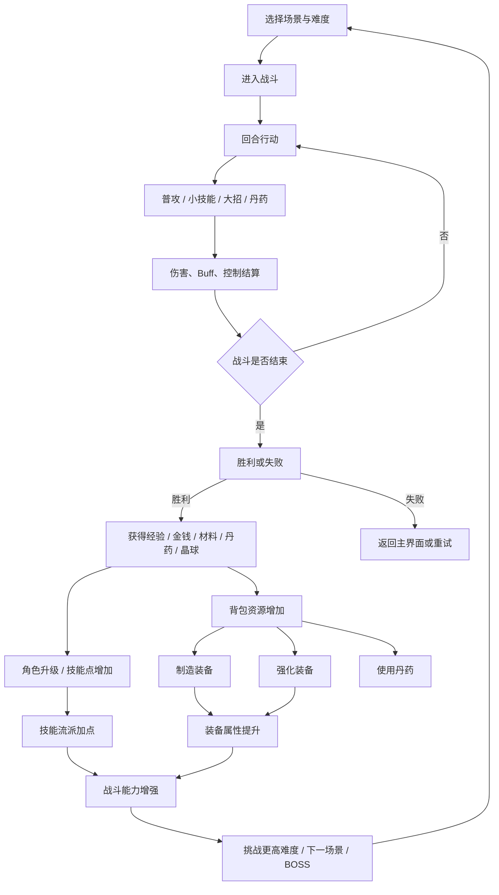

# 《西游斗战》完整系统设计稿

## 0. 文档目标与范围

本文档基于《西游斗战》知识库整理，形成可落地的系统设计稿，覆盖以下核心内容：

1. **核心循环图**：明确玩家目标、战斗、资源获取、制造强化、角色成长、关卡推进之间的关系。
2. **资源流转表**：梳理材料、丹药、晶球、灵气、装备、金钱、碎片、技艺经验、任务奖励的来源与用途。
3. **界面线框**：以水墨风格为基础，规划主界面、战斗界面、技能流派、背包、制造、强化、角色、任务、存档等界面结构。
4. **数值骨架**：定义玩家成长、敌人成长、技能、装备、词缀、Buff、BOSS、经验、掉落与经济控制。
5. **Demo 里程碑规划**：给出从原型到可玩垂直切片的开发路径、验收标准与风险项。

本项目定位为：  
**西游记题材水墨风格回合制小型 RPG，核心体验为战斗、刷材料、制造装备、强化成长、挑战 BOSS。**

整体设计原则：

- 不使用任何形式的图片、图标、特殊字体。
- UI 以文字、线条、色块、边框、留白表现水墨气质。
- 数值控制在低到中等规模，最终常规数值不超过 10000。
- 系统之间必须形成闭环：战斗产生资源，资源强化角色，角色挑战更高难度。
- Demo 优先保证核心循环可玩，而非一次性完成全部内容。

---

# 1. 核心循环图

## 1.1 总核心循环

游戏的核心循环可以概括为：

```text
选择场景与难度
      ↓
进入回合制战斗
      ↓
使用普攻 / 小技能 / 大招 / 丹药 / 自动战斗
      ↓
判定胜负
      ↓
获得经验、金钱、材料、丹药、晶球、装备图纸或配方进度
      ↓
提升等级 / 解锁技能点 / 提升技艺
      ↓
制造装备 / 强化装备 / 升星装备 / 调整流派技能
      ↓
属性提升
      ↓
挑战更高难度 / 解锁下一场景 / 挑战 BOSS
      ↓
获得更高阶资源
      ↓
回到装备强化与角色成长循环
```

更抽象地表达：

```text
战斗 → 掉落 → 制造与强化 → 属性成长 → 更高战斗 → 更高掉落 → 终局 BOSS
```

---

## 1.2 玩家成长循环

玩家成长由四条线组成：

```text
角色等级成长
      ↓
基础属性提升
      ↓
解锁技能点
      ↓
选择流派 / 被动 / 小技能 / 大招

装备成长
      ↓
材料收集
      ↓
装备制作
      ↓
品质、强化、升星、词条

技艺成长
      ↓
制造经验提升
      ↓
更高装备属性加成
      ↓
更高品质制造结果

关卡成长
      ↓
通关简单
      ↓
解锁普通
      ↓
解锁困难
      ↓
解锁场景 BOSS
      ↓
解锁隐藏 BOSS / 三大 BOSS / 最终 BOSS
```

---

## 1.3 战斗内循环

战斗内循环围绕能量与行动顺序展开：

```text
回合开始
      ↓
按速度决定行动顺序
      ↓
单位行动
      ↓
判断能量是否足够
      ↓
选择普攻 / 小技能 / 大招 / 丹药 / 防御或自动行为
      ↓
结算命中、闪避、暴击、伤害、Buff、Debuff、控制
      ↓
被攻击方获得能量
      ↓
回合结束
      ↓
判断胜负
```

玩家每回合获得能量：

```text
回合开始：+25 能量
受到攻击：+15 能量
```

技能消耗：

```text
小技能：50 能量
大招：150 能量
```

因此战斗节奏为：

```text
前期普攻或释放小技能
      ↓
能量积累
      ↓
释放小技能 / 大招
      ↓
通过流派与装备词条放大输出或生存能力
```

---

## 1.4 资源与制造循环

```text
敌人掉落基础材料
      ↓
玩家收集材料
      ↓
消耗材料 + 金钱制造装备
      ↓
获得破损 / 普通 / 精良 / 极品品质装备
      ↓
使用晶球 / 异矿 / 灵水 / 灵气强化装备
      ↓
使用同名装备升星
      ↓
属性提升
      ↓
挑战更高难度敌人
      ↓
获得更高阶材料
```

装备成长闭环：

```text
一阶装备
      ↓
二阶装备
      ↓
三阶装备
      ↓
强化 + 升星 + 词条
      ↓
挑战 BOSS 与最终 BOSS
```

---

## 1.5 关卡推进循环

```text
关卡 1 默认解锁
      ↓
通关简单
      ↓
解锁下一关卡
      ↓
通关当前难度全部敌人
      ↓
解锁普通
      ↓
通关普通
      ↓
解锁困难
      ↓
通关困难
      ↓
解锁该关 BOSS
      ↓
通关全部场景困难 + 击败全部场景 BOSS
      ↓
解锁最终 BOSS 六耳猕猴
```

---

## 1.6 Mermaid 核心循环图



---

# 2. 资源流转表

本章梳理游戏中所有主要资源的来源、用途、消耗与循环意义。

---

## 2.1 资源总览

| 资源类型 | 代表资源 | 主要来源 | 主要用途 | 是否消耗 | 设计目的 |
|---|---|---|---|---|---|
| 基础材料 | 桃木、松木、铁木、粗石、铜精、铁精、金精等 | 普通敌人掉落 | 制造装备 | 是 | 构成制造基础 |
| 皮革材料 | 鹿皮、熊皮、虎皮、仙云皮 | 特定敌人掉落 | 制造皮甲 | 是 | 对应衣服体系 |
| 玉石材料 | 淡水玉、深水玉、圣水玉、翡翠玉镯 | 特定敌人掉落 | 制造饰品 | 是 | 支撑饰品制造 |
| 杂物 | 青花瓷、古铜镜、宣纸、珍珠、寒潭水等 | 场景敌人掉落 | 制造、出售、特殊用途 | 是 | 丰富掉落结构 |
| 金钱 | 金钱 | 战斗奖励、出售物品、任务 | 制造、强化、购买 | 是 | 通用经济资源 |
| 丹药 | 疗伤丹、元气丹、攻防速全属性丹 | 敌人掉落、任务、商店 | 战斗恢复与临时增益 | 是 | 提供战术选择 |
| 晶球 | 灿金晶球、清辉晶球、玲珑晶球 | 守护者、精英、BOSS、高难掉落 | 强化武器 / 衣服 / 饰品，或开启强化材料 | 是 | 强化资源入口 |
| 强化材料 | 异矿、灵水、灵气 | 晶球开启、BOSS 掉落 | 强化武器、衣服、饰品 | 是 | 装备强化消耗 |
| 稀有灵气 | 地脉灵气、天罡灵气、混元灵气 | 高阶敌人、BOSS、碎片合成 | 高级强化、传说内容 | 是 | 后期稀有资源 |
| 碎片 | 天罡灵气碎片、混元灵气碎片、九转金丹碎片、玉佛像碎片 | 高阶敌人、隐藏 BOSS | 合成稀有资源 | 是 | 长线收集目标 |
| 装备 | 武器、衣服、饰品 | 制造、BOSS、特殊奖励 | 穿戴提升属性 | 否，可替换 | 核心成长线 |
| 技艺经验 | 武器制作经验、衣服制作经验、饰品制作经验 | 制造对应装备 | 提升技艺等级 | 否 | 制造成长线 |
| 经验值 | 战斗经验 | 击败敌人、任务 | 玩家升级 | 否 | 角色成长线 |
| 技能点 | 被动点、小技能点、大招点 | 等级解锁 | 选择流派技能 | 否，可重置 | Build 成长线 |
| 任务进度 | 西行志任务 | 战斗、收集、制造 | 领取奖励 | 否 | 引导玩家目标 |

---

## 2.2 基础材料流转表

| 材料 | 获取来源 | 获取阶段 | 用途 | 消耗去向 |
|---|---|---|---|---|
| 桃木 | 小花山敌人 | 关卡 1 | 一阶轻型、中型武器，一阶木甲 | 装备制造 |
| 粗石 | 小花山、碎石坡敌人 | 关卡 1-3 | 一阶重型武器、一阶铠甲、部分饰品 | 装备制造 |
| 铜精 | 小花山、浅水涧、碎石坡 | 关卡 1-3 | 一阶武器、饰品、铠甲 | 装备制造 |
| 淡水玉 | 小花山、浅水涧 | 关卡 1-2 | 一阶护符、手镯 | 饰品制造 |
| 贝壳 | 浅水涧 | 关卡 2 | 一阶戒指、手镯 | 饰品制造 |
| 鹿皮 | 迷雾林 | 关卡 4 | 一阶皮甲 | 衣服制造 |
| 宣纸 | 迷雾林 | 关卡 4 | 一阶腰带 | 饰品制造 |
| 松木 | 碎石坡、迷雾林 | 关卡 3-4 | 二阶武器、二阶木甲 | 二阶装备制造 |
| 铁精 | 碎石坡、浊浪滩、熔岩洞 | 关卡 3-6 | 二阶武器、衣服、饰品 | 二阶装备制造 |
| 深水玉 | 迷雾林、浊浪滩 | 关卡 4-5 | 二阶护符、手镯、饰品 | 二阶饰品制造 |
| 青花瓷 | 迷雾林、浊浪滩、熔岩洞 | 关卡 4-6 | 二阶戒指、腰带 | 二阶饰品制造 |
| 熊皮 | 迷雾林、蛛丝谷 | 关卡 4-7 | 二阶皮甲 | 二阶衣服制造 |
| 铁木 | 熔岩洞 | 关卡 6 | 三阶武器、三阶木甲 | 三阶装备制造 |
| 铁焰矿 | 熔岩洞 | 关卡 6 | 特殊装备材料 | 特殊制造或强化扩展 |
| 古铜镜 | 熔岩洞、狂风岭 | 关卡 6-8 | 三阶腰带 | 三阶饰品制造 |
| 金精 | 熔岩洞、狂风岭 | 关卡 6-8 | 三阶武器、铠甲、冠冕 | 三阶装备制造 |
| 圣水玉 | 浊浪滩、禅音崖 | 关卡 5、9 | 三阶护符、手镯、冠冕 | 三阶饰品制造 |
| 翡翠玉镯 | 蛛丝谷 | 关卡 7 | 三阶戒指、手镯 | 三阶饰品制造 |
| 虎皮 | 狂风岭 | 关卡 8 | 三阶皮甲 | 三阶衣服制造 |
| 仙云皮 | 蛛丝谷、禅音崖 | 关卡 7-9 | 三阶皮甲、项链 | 三阶衣服 / 饰品制造 |
| 珍珠 | 浅水涧守护者 | 关卡 2 困难 | 特殊饰品或出售 | 扩展饰品 / 经济 |
| 寒潭水 | 蛛丝谷 | 关卡 7 | 特殊丹药材料 | 炼丹扩展 |
| 毒液 | 蛛丝谷 | 关卡 7 | 毒属性丹药或武器附伤 | 战术扩展 |
| 金阳矿 | 狂风岭 | 关卡 8 | 特殊装备材料 | 特殊制造 |
| 神泉水 | 狂风岭 | 关卡 8 | 高级丹药材料 | 炼丹扩展 |
| 玉佛像 / 玉佛像碎片 | 禅音崖 | 关卡 9 | 高级饰品或特殊装备 | 稀有制造 |

---

## 2.3 晶球与强化资源流转表

知识库中存在两种表达：

1. 晶球可开启获得异矿、灵水、灵气。
2. JSON 中晶球可直接用于强化武器、衣服、饰品。

为保证系统闭环清晰，本设计稿建议统一为：

```text
未开启晶球
      ↓
开启
      ↓
获得对应类型强化材料
      ↓
用于装备强化
```

同时保留 JSON 中晶球的强化用途，作为开启后的结果物。

| 晶球 | 对应部位 | 开启获得建议 | 用途 |
|---|---|---|---|
| 灿金晶球 | 武器 | 异矿 | 强化武器攻击力 |
| 清辉晶球 | 衣服 | 灵气 | 强化衣服防御力 |
| 玲珑晶球 | 饰品 | 灵水 | 强化饰品属性加成 |

强化规则：

```text
强化消耗：对应强化材料 + 金钱
强化上限：一阶 +5，二阶 +10，三阶 +15
每级提升：5% 基础属性
失败率：50%
失败结果：不降级，仅消耗材料与金钱
```

建议 Demo 阶段简化为：

```text
强化成功率：50%
失败：仅损失材料，不破坏装备
```

这样既保留挫败感，又不会过度破坏玩家资产。

---

## 2.4 丹药资源流转表

| 丹药 | 来源 | 用途 | 消耗场景 | 设计意义 |
|---|---|---|---|---|
| 疗伤丹药 | 普通敌人、任务、商店 | 恢复 100 气血 | 战斗中 / 战斗外 | 基础生存 |
| 元气丹 | 敌人、隐藏 BOSS、商店 | 恢复 50 能量 | 战斗中 | 加快技能释放 |
| 攻击丹药 | 精英、BOSS、任务 | 攻击 +20%，3 回合 | 战斗中 | 爆发输出 |
| 防御丹药 | 精英、BOSS、任务 | 防御 +20%，3 回合 | 战斗中 | 降低生存压力 |
| 速度丹药 | 特定敌人、任务 | 速度 +20%，3 回合 | 战斗中 | 抢先手 |
| 全属性丹药 | 高阶敌人、任务 | 全属性 +10%，3 回合 | 战斗中 | 稀有战术资源 |
| 九转金丹 | 三大 BOSS、碎片合成 | 永久提升全属性并恢复 | 战斗外 | 终局奖励 |

丹药设计原则：

- 普通丹药用于日常战斗。
- 稀有丹药用于 BOSS 战或关键卡点。
- 九转金丹作为长期目标奖励，不宜大量产出。

---

## 2.5 装备资源流转表

| 装备类型 | 来源 | 成长方式 | 消耗资源 | 目标 |
|---|---|---|---|---|
| 武器 | 制造、BOSS 奖励 | 强化、升星、词条、品质 | 木材、矿石、金属、金钱 | 提升攻击 |
| 衣服 | 制造、BOSS 奖励 | 强化、升星、词条、品质 | 皮革、木材、金属、金钱 | 提升防御与生存 |
| 饰品 | 制造、稀有掉落 | 强化、升星、词条、品质 | 玉石、贝壳、珍珠、金属、金钱 | 提升百分比属性 |

装备品质：

| 品质 | 基础属性 | 词条数 |
|---|---:|---:|
| 破损 | 90% | 0 |
| 普通 | 100% | 1 |
| 精良 | 110% | 2 |
| 极品 | 120% | 3 |

装备升星：

```text
默认 0 星
最高 3 星
升星消耗相同装备：
1 星：3 件
2 星：6 件
3 星：9 件
每星提升 10% 基础属性
```

---

## 2.6 技艺经验流转表

| 技艺 | 获取方式 | 作用 | 升级效果 |
|---|---|---|---|
| 武器制作 | 制造武器 | 提升武器最终属性 | 每级提升 5% 装备最大属性 |
| 衣服制作 | 制造衣服 | 提升衣服最终属性 | 每级提升 5% 装备最大属性 |
| 饰品制作 | 制造饰品 | 提升饰品最终属性 | 每级提升 5% 装备最大属性 |

技艺经验规则：

```text
每次制作对应装备：对应技艺经验 +1
达到经验要求：技艺等级 +1
经验重置为 0
技艺等级范围：1-10 级
```

技艺经验需求：

```text
[2, 3, 5, 8, 12, 17, 23, 30, 38, 47]
```

---

## 2.7 金钱流转表

| 来源 | 获取方式 | 用途 |
|---|---|---|
| 战斗奖励 | 击败敌人 | 制造装备 |
| 出售物品 | 出售杂物、多余材料 | 强化装备 |
| 任务奖励 | 完成西行志任务 | 购买丹药 |
| BOSS 奖励 | 击败 BOSS | 购买基础材料补充 |
| 成就或里程碑奖励 | 可选扩展 | 扩展商店消费 |

金钱消耗设计：

```text
制造装备：固定金钱消耗
强化装备：强化等级越高，金钱越高
升星装备：可加入少量金钱手续费
商店购买：购买丹药、基础材料、配方解锁等
```

建议 Demo 阶段金钱主要消耗在：

```text
装备制造 > 装备强化 > 丹药购买
```

---

## 2.8 任务系统资源流转

任务系统命名为 **「西行志」**。

任务类型：

| 任务类型 | 示例 | 奖励 |
|---|---|---|
| 收集任务 | 收集 10 个桃木 | 金钱、经验 |
| 战斗任务 | 击败 5 只花妖 | 经验、丹药 |
| 制造任务 | 制造任意一件装备 | 材料、金钱 |
| 品质任务 | 制造一件精良装备 | 稀有材料、晶球 |
| 强化任务 | 强化装备至 +3 | 强化材料 |
| 关卡任务 | 通关小花山普通 | 解锁奖励、金钱 |
| BOSS 任务 | 击败花妖王·灵根 | 稀有丹药、碎片 |
| 技艺任务 | 武器制作达到 3 级 | 金钱、材料 |

任务奖励原则：

```text
前期：经验、金钱、基础丹药
中期：材料、晶球、强化材料
后期：碎片、稀有灵气、九转金丹碎片
```

---

## 2.9 物品数据附录（全量配置）

以下为完整物品数据（可直接作为制造、掉落、商店、稀有度判定的数据源）。

```json
{
  "items": {
    "materials": [
      {
        "id": "mat_001",
        "name": "桃木",
        "type": "木材",
        "description": "普通桃树的木材，质地轻盈坚韧，适合制作轻型武器和木甲。",
        "rarity": "普通",
        "use": "制作一阶装备的基础材料",
        "stackable": true,
        "max_stack": 99,
        "sell_price": 5,
        "buy_price": 10
      },
      {
        "id": "mat_002",
        "name": "粗石",
        "type": "矿石",
        "description": "粗糙的石块，蕴含微弱的地脉灵气，可用于基础装备制作。",
        "rarity": "普通",
        "use": "制作一阶装备和饰品的基础材料",
        "stackable": true,
        "max_stack": 99,
        "sell_price": 3,
        "buy_price": 6
      },
      {
        "id": "mat_003",
        "name": "铜精",
        "type": "金属",
        "description": "经过初步提炼的铜矿石精华，具有较好的延展性和韧性。",
        "rarity": "普通",
        "use": "制作一阶装备和饰品的主要金属材料",
        "stackable": true,
        "max_stack": 99,
        "sell_price": 8,
        "buy_price": 16
      },
      {
        "id": "mat_004",
        "name": "淡水玉",
        "type": "玉石",
        "description": "产自淡水河流中的玉石，蕴含温和的水属性灵气。",
        "rarity": "普通",
        "use": "制作一阶饰品护符和手镯",
        "stackable": true,
        "max_stack": 99,
        "sell_price": 10,
        "buy_price": 20
      },
      {
        "id": "mat_005",
        "name": "贝壳",
        "type": "水产",
        "description": "河滩上常见的贝壳，可用于制作简单的装饰品。",
        "rarity": "普通",
        "use": "制作一阶饰品戒指和手镯",
        "stackable": true,
        "max_stack": 99,
        "sell_price": 4,
        "buy_price": 8
      },
      {
        "id": "mat_006",
        "name": "松木",
        "type": "木材",
        "description": "松树的木材，质地比桃木更坚硬，适合制作中型武器。",
        "rarity": "普通",
        "use": "制作二阶装备的基础材料",
        "stackable": true,
        "max_stack": 99,
        "sell_price": 12,
        "buy_price": 24
      },
      {
        "id": "mat_007",
        "name": "铁精",
        "type": "金属",
        "description": "精炼过的铁矿石，硬度高且耐磨，适合制作中级装备。",
        "rarity": "普通",
        "use": "制作二阶装备和饰品的主要金属材料",
        "stackable": true,
        "max_stack": 99,
        "sell_price": 15,
        "buy_price": 30
      },
      {
        "id": "mat_008",
        "name": "深水玉",
        "type": "玉石",
        "description": "产自深水区域的玉石，蕴含更浓郁的水属性灵气。",
        "rarity": "普通",
        "use": "制作二阶饰品护符和手镯",
        "stackable": true,
        "max_stack": 99,
        "sell_price": 18,
        "buy_price": 36
      },
      {
        "id": "mat_009",
        "name": "鹿皮",
        "type": "皮革",
        "description": "鹿的皮革，柔软且坚韧，适合制作轻型护甲。",
        "rarity": "普通",
        "use": "制作一阶皮甲的基础材料",
        "stackable": true,
        "max_stack": 99,
        "sell_price": 7,
        "buy_price": 14
      },
      {
        "id": "mat_010",
        "name": "宣纸",
        "type": "织物",
        "description": "传统制作的宣纸，轻盈且有韧性，可用于制作饰品。",
        "rarity": "普通",
        "use": "制作一阶饰品腰带",
        "stackable": true,
        "max_stack": 99,
        "sell_price": 6,
        "buy_price": 12
      },
      {
        "id": "mat_011",
        "name": "青花瓷",
        "type": "陶瓷",
        "description": "精美的青花瓷器碎片，具有艺术价值和灵气。",
        "rarity": "普通",
        "use": "制作二阶饰品戒指和腰带",
        "stackable": true,
        "max_stack": 99,
        "sell_price": 20,
        "buy_price": 40
      },
      {
        "id": "mat_012",
        "name": "熊皮",
        "type": "皮革",
        "description": "熊的皮革，厚实耐磨，适合制作中级皮甲。",
        "rarity": "普通",
        "use": "制作二阶皮甲的基础材料",
        "stackable": true,
        "max_stack": 99,
        "sell_price": 25,
        "buy_price": 50
      },
      {
        "id": "mat_013",
        "name": "铁木",
        "type": "木材",
        "description": "质地坚硬如铁的木材，极为稀有，适合制作高级装备。",
        "rarity": "稀有",
        "use": "制作三阶装备的基础材料",
        "stackable": true,
        "max_stack": 99,
        "sell_price": 40,
        "buy_price": 80
      },
      {
        "id": "mat_014",
        "name": "铁焰矿",
        "type": "矿石",
        "description": "在火焰山附近找到的特殊矿石，蕴含火属性灵气。",
        "rarity": "普通",
        "use": "制作特殊装备的材料",
        "stackable": true,
        "max_stack": 99,
        "sell_price": 25,
        "buy_price": 50
      },
      {
        "id": "mat_015",
        "name": "古铜镜",
        "type": "古董",
        "description": "古老的铜镜，蕴含着神秘的灵气，可用于制作高级饰品。",
        "rarity": "稀有",
        "use": "制作三阶饰品腰带",
        "stackable": true,
        "max_stack": 99,
        "sell_price": 60,
        "buy_price": 120
      },
      {
        "id": "mat_016",
        "name": "金精",
        "type": "金属",
        "description": "提炼出的黄金精华，极其珍贵，适合制作顶级装备。",
        "rarity": "稀有",
        "use": "制作三阶装备和饰品的主要金属材料",
        "stackable": true,
        "max_stack": 99,
        "sell_price": 80,
        "buy_price": 160
      },
      {
        "id": "mat_017",
        "name": "圣水玉",
        "type": "玉石",
        "description": "蕴含神圣水属性的玉石，极为纯净，适合制作顶级饰品。",
        "rarity": "稀有",
        "use": "制作三阶饰品护符和手镯",
        "stackable": true,
        "max_stack": 99,
        "sell_price": 70,
        "buy_price": 140
      },
      {
        "id": "mat_018",
        "name": "翡翠玉镯",
        "type": "玉石",
        "description": "翡翠制成的玉镯，蕴含强大的灵气，可大幅提升属性。",
        "rarity": "稀有",
        "use": "制作三阶饰品戒指和手镯",
        "stackable": true,
        "max_stack": 99,
        "sell_price": 90,
        "buy_price": 180
      },
      {
        "id": "mat_019",
        "name": "仙云皮",
        "type": "皮革",
        "description": "仙兽的皮革，轻盈如云却坚韧无比，适合制作顶级皮甲。",
        "rarity": "稀有",
        "use": "制作三阶皮甲的基础材料",
        "stackable": true,
        "max_stack": 99,
        "sell_price": 100,
        "buy_price": 200
      },
      {
        "id": "mat_020",
        "name": "虎皮",
        "type": "皮革",
        "description": "猛虎的皮革，极具威严和力量，适合制作高级皮甲。",
        "rarity": "普通",
        "use": "制作三阶皮甲的基础材料",
        "stackable": true,
        "max_stack": 99,
        "sell_price": 50,
        "buy_price": 100
      },
      {
        "id": "mat_021",
        "name": "珍珠",
        "type": "水产",
        "description": "河蚌中孕育的珍珠，散发着温和的光芒，可用于制作饰品。",
        "rarity": "普通",
        "use": "制作特殊饰品",
        "stackable": true,
        "max_stack": 99,
        "sell_price": 30,
        "buy_price": 60
      },
      {
        "id": "mat_022",
        "name": "寒潭水",
        "type": "液体",
        "description": "取自寒潭的冰水，蕴含冰属性灵气，可用于特殊丹药炼制。",
        "rarity": "普通",
        "use": "炼制特殊丹药的材料",
        "stackable": true,
        "max_stack": 99,
        "sell_price": 15,
        "buy_price": 30
      },
      {
        "id": "mat_023",
        "name": "毒液",
        "type": "毒物",
        "description": "蜘蛛精的毒液，可炼制毒属性丹药或涂抹在武器上。",
        "rarity": "普通",
        "use": "炼制毒属性丹药或制作毒属性武器",
        "stackable": true,
        "max_stack": 99,
        "sell_price": 20,
        "buy_price": 40
      },
      {
        "id": "mat_024",
        "name": "金阳矿",
        "type": "矿石",
        "description": "在狮驼岭发现的金色矿石，蕴含太阳灵气。",
        "rarity": "稀有",
        "use": "制作特殊装备的材料",
        "stackable": true,
        "max_stack": 99,
        "sell_price": 55,
        "buy_price": 110
      },
      {
        "id": "mat_025",
        "name": "神泉水",
        "type": "液体",
        "description": "神鸟栖息之地的泉水，蕴含风属性灵气。",
        "rarity": "稀有",
        "use": "炼制高级丹药的材料",
        "stackable": true,
        "max_stack": 99,
        "sell_price": 45,
        "buy_price": 90
      },
      {
        "id": "mat_026",
        "name": "玉佛像",
        "type": "古董",
        "description": "雕刻精美的玉佛像，蕴含强大的佛门灵气。",
        "rarity": "稀有",
        "use": "制作顶级饰品或特殊装备",
        "stackable": true,
        "max_stack": 99,
        "sell_price": 150,
        "buy_price": 300
      }
    ],
    "spirit_essences": [
      {
        "id": "ess_001",
        "name": "地脉灵气",
        "type": "灵气",
        "description": "大地脉动中提取的纯净灵气，蕴含土属性力量。",
        "rarity": "稀有",
        "use": "用于装备强化和高级丹药炼制",
        "stackable": true,
        "max_stack": 99,
        "sell_price": 100,
        "buy_price": 200
      },
      {
        "id": "ess_002",
        "name": "天罡灵气",
        "type": "灵气",
        "description": "来自天罡星辰的灵气，蕴含强大的星辰之力。",
        "rarity": "传说",
        "use": "用于顶级装备强化和传说丹药炼制",
        "stackable": true,
        "max_stack": 99,
        "sell_price": 300,
        "buy_price": 600
      },
      {
        "id": "ess_003",
        "name": "混元灵气",
        "type": "灵气",
        "description": "混沌初开时存在的原始灵气，蕴含创世之力。",
        "rarity": "传说",
        "use": "用于传说装备的最终强化",
        "stackable": true,
        "max_stack": 99,
        "sell_price": 500,
        "buy_price": 1000
      }
    ],
    "crystal_spheres": [
      {
        "id": "crys_001",
        "name": "一阶灿金晶球",
        "type": "晶球",
        "description": "蕴含金属性灵气的晶球，可用于强化一阶武器。",
        "rarity": "普通",
        "use": "强化一阶武器，每级提升攻击力5%",
        "stackable": true,
        "max_stack": 99,
        "sell_price": 50,
        "buy_price": 100,
        "tier": 1,
        "effect": "强化武器攻击力"
      },
      {
        "id": "crys_002",
        "name": "二阶灿金晶球",
        "type": "晶球",
        "description": "蕴含更浓郁金属性灵气的晶球，可用于强化二阶武器。",
        "rarity": "普通",
        "use": "强化二阶武器，每级提升攻击力5%",
        "stackable": true,
        "max_stack": 99,
        "sell_price": 100,
        "buy_price": 200,
        "tier": 2,
        "effect": "强化武器攻击力"
      },
      {
        "id": "crys_003",
        "name": "三阶灿金晶球",
        "type": "晶球",
        "description": "蕴含纯粹金属性灵气的晶球，可用于强化三阶武器。",
        "rarity": "稀有",
        "use": "强化三阶武器，每级提升攻击力5%",
        "stackable": true,
        "max_stack": 99,
        "sell_price": 200,
        "buy_price": 400,
        "tier": 3,
        "effect": "强化武器攻击力"
      },
      {
        "id": "crys_004",
        "name": "一阶清辉晶球",
        "type": "晶球",
        "description": "蕴含木属性灵气的晶球，可用于强化一阶衣服。",
        "rarity": "普通",
        "use": "强化一阶衣服，每级提升防御力5%",
        "stackable": true,
        "max_stack": 99,
        "sell_price": 40,
        "buy_price": 80,
        "tier": 1,
        "effect": "强化衣服防御力"
      },
      {
        "id": "crys_005",
        "name": "二阶清辉晶球",
        "type": "晶球",
        "description": "蕴含更浓郁木属性灵气的晶球，可用于强化二阶衣服。",
        "rarity": "普通",
        "use": "强化二阶衣服，每级提升防御力5%",
        "stackable": true,
        "max_stack": 99,
        "sell_price": 80,
        "buy_price": 160,
        "tier": 2,
        "effect": "强化衣服防御力"
      },
      {
        "id": "crys_006",
        "name": "三阶清辉晶球",
        "type": "晶球",
        "description": "蕴含纯粹木属性灵气的晶球，可用于强化三阶衣服。",
        "rarity": "稀有",
        "use": "强化三阶衣服，每级提升防御力5%",
        "stackable": true,
        "max_stack": 99,
        "sell_price": 160,
        "buy_price": 320,
        "tier": 3,
        "effect": "强化衣服防御力"
      },
      {
        "id": "crys_007",
        "name": "一阶玲珑晶球",
        "type": "晶球",
        "description": "蕴含水属性灵气的晶球，可用于强化一阶饰品。",
        "rarity": "普通",
        "use": "强化一阶饰品，每级提升属性加成3%",
        "stackable": true,
        "max_stack": 99,
        "sell_price": 60,
        "buy_price": 120,
        "tier": 1,
        "effect": "强化饰品属性加成"
      },
      {
        "id": "crys_008",
        "name": "二阶玲珑晶球",
        "type": "晶球",
        "description": "蕴含更浓郁水属性灵气的晶球，可用于强化二阶饰品。",
        "rarity": "普通",
        "use": "强化二阶饰品，每级提升属性加成3%",
        "stackable": true,
        "max_stack": 99,
        "sell_price": 120,
        "buy_price": 240,
        "tier": 2,
        "effect": "强化饰品属性加成"
      },
      {
        "id": "crys_009",
        "name": "三阶玲珑晶球",
        "type": "晶球",
        "description": "蕴含纯粹水属性灵气的晶球，可用于强化三阶饰品。",
        "rarity": "稀有",
        "use": "强化三阶饰品，每级提升属性加成3%",
        "stackable": true,
        "max_stack": 99,
        "sell_price": 240,
        "buy_price": 480,
        "tier": 3,
        "effect": "强化饰品属性加成"
      }
    ],
    "elixirs": [
      {
        "id": "elix_001",
        "name": "疗伤丹药",
        "type": "丹药",
        "description": "用普通草药炼制的基础疗伤药，可恢复气血。",
        "rarity": "普通",
        "use": "恢复100点气血",
        "stackable": true,
        "max_stack": 99,
        "sell_price": 10,
        "buy_price": 20,
        "effect": "战斗中或战斗外使用，立即恢复100点气血"
      },
      {
        "id": "elix_002",
        "name": "元气丹",
        "type": "丹药",
        "description": "蕴含天地元气的丹药，可恢复能量。",
        "rarity": "普通",
        "use": "恢复50点能量",
        "stackable": true,
        "max_stack": 99,
        "sell_price": 15,
        "buy_price": 30,
        "effect": "战斗中或战斗外使用，立即恢复50点能量"
      },
      {
        "id": "elix_003",
        "name": "防御丹药",
        "type": "丹药",
        "description": "增强体魄的丹药，临时提升防御力。",
        "rarity": "普通",
        "use": "提升20%防御力，持续3回合",
        "stackable": true,
        "max_stack": 99,
        "sell_price": 20,
        "buy_price": 40,
        "effect": "战斗中可使用，提升20%防御力，持续3回合"
      },
      {
        "id": "elix_004",
        "name": "攻击丹药",
        "type": "丹药",
        "description": "激发潜能的丹药，临时提升攻击力。",
        "rarity": "普通",
        "use": "提升20%攻击力，持续3回合",
        "stackable": true,
        "max_stack": 99,
        "sell_price": 25,
        "buy_price": 50,
        "effect": "战斗中可使用，提升20%攻击力，持续3回合"
      },
      {
        "id": "elix_005",
        "name": "速度丹药",
        "type": "丹药",
        "description": "轻身提气的丹药，临时提升速度。",
        "rarity": "普通",
        "use": "提升20%速度，持续3回合",
        "stackable": true,
        "max_stack": 99,
        "sell_price": 20,
        "buy_price": 40,
        "effect": "战斗中可使用，提升20%速度，持续3回合"
      },
      {
        "id": "elix_006",
        "name": "全属性丹药",
        "type": "丹药",
        "description": "全面提升能力的丹药，但效果较为温和。",
        "rarity": "稀有",
        "use": "提升10%全属性，持续3回合",
        "stackable": true,
        "max_stack": 99,
        "sell_price": 50,
        "buy_price": 100,
        "effect": "战斗中可使用，提升10%攻击、防御、速度、暴击率，持续3回合"
      },
      {
        "id": "elix_007",
        "name": "九转金丹",
        "type": "丹药",
        "description": "传说中的仙丹，历经九转炼制而成，具有逆天功效。",
        "rarity": "传说",
        "use": "永久提升1点全属性，并恢复全部气血和能量",
        "stackable": true,
        "max_stack": 5,
        "sell_price": 1000,
        "buy_price": 2000,
        "effect": "战斗外使用，永久提升1点攻击、防御、速度、暴击率，并立即恢复全部气血和能量"
      }
    ],
    "currency": {
      "gold": {
        "id": "curr_001",
        "name": "金钱",
        "type": "货币",
        "description": "游戏中的通用货币，可用于购买物品、制作装备等。",
        "stackable": true,
        "max_stack": 999999,
        "icon": ""
      }
    },
    "fragments": [
      {
        "id": "frag_001",
        "name": "天罡灵气碎片",
        "type": "碎片",
        "description": "天罡灵气的碎片，收集一定数量可合成完整的天罡灵气。",
        "rarity": "稀有",
        "use": "10个碎片可合成1个天罡灵气",
        "stackable": true,
        "max_stack": 99,
        "sell_price": 30,
        "buy_price": 60
      },
      {
        "id": "frag_002",
        "name": "混元灵气碎片",
        "type": "碎片",
        "description": "混元灵气的碎片，收集一定数量可合成完整的混元灵气。",
        "rarity": "稀有",
        "use": "10个碎片可合成1个混元灵气",
        "stackable": true,
        "max_stack": 99,
        "sell_price": 50,
        "buy_price": 100
      },
      {
        "id": "frag_003",
        "name": "九转金丹碎片",
        "type": "碎片",
        "description": "九转金丹的碎片，收集一定数量可合成完整的九转金丹。",
        "rarity": "传说",
        "use": "5个碎片可合成1个九转金丹",
        "stackable": true,
        "max_stack": 99,
        "sell_price": 200,
        "buy_price": 400
      },
      {
        "id": "frag_004",
        "name": "玉佛像碎片",
        "type": "碎片",
        "description": "玉佛像的碎片，收集一定数量可合成完整的玉佛像。",
        "rarity": "稀有",
        "use": "5个碎片可合成1个玉佛像",
        "stackable": true,
        "max_stack": 99,
        "sell_price": 30,
        "buy_price": 60
      }
    ]
  },
  "item_categories": {
    "materials": ["木材", "矿石", "金属", "玉石", "水产", "皮革", "织物", "陶瓷", "古董", "液体", "毒物", "灵气"],
    "crystal_spheres": ["灿金晶球", "清辉晶球", "玲珑晶球"],
    "elixirs": ["疗伤", "恢复", "属性提升"],
    "currency": ["金钱"],
    "fragments": ["灵气碎片", "丹药碎片", "装备碎片"]
  },
  "rarity_levels": {
    "common": {
      "name": "普通",
      "color": "#666666",
      "weight": 70
    },
    "rare": {
      "name": "稀有",
      "color": "#2E8B57",
      "weight": 25
    },
    "legendary": {
      "name": "传说",
      "color": "#D4AF37",
      "weight": 5
    }
  }
}
```

---

# 3. 界面线框

本章描述主要界面布局。所有界面遵循：

- 宣纸白底色。
- 墨色边框。
- 朱红点缀关键操作。
- 金色用于高阶或确认状态。
- 不使用图片、图标、特殊字体。
- 布局紧凑，避免过大间距。
- 交互反馈以墨晕、边框、淡入淡出为主。

---

## 3.1 主界面总体布局

```text
+--------------------------------------------------------------------------------------+
| 西游斗战                                                             金钱：000000    |
+--------------+----------------------------------------------+------------------------+
|              |                                              |                        |
| 场景卷轴     |                战斗禅台                      |      功能宝阁          |
|              |                                              |                        |
| 降妖路引     | 当前场景：小花山                             | [背包] [技艺] [角色]   |
|              | 难度：简单                                   | [流派] [洞府] [任务]   |
| 关卡 1       | 敌人等级：1-2                                |                        |
| 小花山       |                                              | ---------------------- |
| 已解锁       | 玩家                敌方                     |                        |
|              | 气血 350/420        气血 280/320             | 当前页签内容           |
| 关卡 2       | 能量 120/150        能量 90/150              |                        |
| 浅水涧       |                                              | 物品列表 / 角色属性    |
| 未解锁       | [自动战斗] [普攻] [小技能1] [小技能2] [大招] | 制造列表 / 技能树      |
|              |                                              | 任务列表 / 洞府操作    |
| 关卡 3       | 战斗日志                                     |                        |
| 碎石坡       | 回合 1：玩家使用普攻                         |                        |
| 未解锁       | 回合 1：花妖使用藤蔓                         |                        |
|              | 回合 2：玩家触发连击                         |                        |
+--------------+----------------------------------------------+------------------------+
```

---

## 3.2 左侧场景卷轴线框

```text
+----------------------+
|      降 妖 路 引      |
+----------------------+
| [当前] 小花山         |
| 难度：简单/普通/困难  |
| 等级：1-2             |
| 状态：已解锁          |
+----------------------+
| 浅水涧                |
| 解锁条件：通关小花山  |
| 等级：3-4             |
| 状态：未解锁          |
+----------------------+
| 碎石坡                |
| 解锁条件：通关浅水涧  |
| 等级：5-6             |
| 状态：未解锁          |
+----------------------+
| 迷雾林                |
| 解锁条件：通关碎石坡  |
| 等级：7-8             |
| 状态：未解锁          |
+----------------------+
|        滚动条         |
+----------------------+
```

交互说明：

- 已解锁场景：浓墨边框。
- 当前场景：朱红边框。
- 未解锁场景：淡墨灰字。
- 鼠标悬停：轻微墨晕。
- 点击场景：中间战斗区域切换。
- 通关困难后：场景卡片追加「BOSS」入口。

---

## 3.3 中间战斗禅台线框

```text
+------------------------------------------------------+
|                 当前场景：小花山                      |
|                 难度：简单                            |
|                 敌人等级：1-2                         |
+------------------------------------------------------+
|                                                      |
| 玩家                        敌方                     |
| 名称：行者                  名称：花妖               |
| 等级：5                     等级：1                  |
|                                                      |
| 气血 [██████████----]       气血 [██████------]      |
| 350 / 420                   280 / 320                |
|                                                      |
| 能量 [██████------]         能量 [████--------]      |
| 120 / 150                   90 / 150                 |
|                                                      |
| 状态：攻击上升 2 回合       状态：中毒 1 层          |
|                                                      |
+------------------------------------------------------+
| [自动战斗] [普攻] [小技能1] [小技能2] [大招] [丹药] |
+------------------------------------------------------+
|                     战 斗 心 经                      |
| 回合 1：玩家使用「分身斩」，造成 58 点伤害           |
| 回合 1：花妖使用「藤蔓缠绕」，造成 12 点伤害         |
| 回合 2：玩家触发「迅捷连击」，追加 29 点伤害         |
| 回合 2：花妖气血归零，战斗结束                       |
+------------------------------------------------------+
```

按钮状态：

| 按钮 | 可用状态 | 不可用状态 |
|---|---|---|
| 普攻 | 始终可用 | 被沉默、束缚、眩晕等控制时不可用 |
| 小技能 | 能量 ≥ 50 | 能量不足时灰显 |
| 大招 | 能量 = 150 | 能量不足时灰显 |
| 丹药 | 有可用丹药 | 无丹药时灰显 |
| 自动战斗 | 开关切换 | 战斗中可随时切换 |

---

## 3.4 技能流派选择线框

技能界面采用三列流派布局。每个流派占两行：

- 第一行：流派名称与小技能、被动。
- 第二行：大招。
- 每项能力使用正方形卡片展示。
- 卡片内第一行为能力名称。
- 卡片内第二行为能力类型，灰色小字。
- 已选择：金色边框与淡金背景。
- 未选择：灰色边框与淡灰背景。
- 查看中：蓝色边框与淡蓝背景。

```text
+--------------------------------------------------------------------------------------+
|                              流 派 修 行                                              |
| 技能点：被动 1/1    小技能 2/2    大招 1/1                                            |
+--------------------------------------------------------------------------------------+
| 灵猴道                                                                                |
| +--------------+ +--------------+ +--------------+ +--------------+                  |
| | 分身斩       | | 疾风步       | | 乱舞         | | 迅捷连击     |                  |
| | 小技能       | | 小技能       | | 小技能       | | 被动         |                  |
| +--------------+ +--------------+ +--------------+ +--------------+                  |
| +--------------+ +--------------+                                                     |
| | 千影绝杀     | | 神行百变     |                                                     |
| | 大招         | | 大招         |                                                     |
| +--------------+ +--------------+                                                     |
+--------------------------------------------------------------------------------------+
| 金行道                                                                                |
| +--------------+ +--------------+ +--------------+ +--------------+                  |
| | 弱点打击     | | 破甲斩       | | 蓄势一击     | | 致命精准     |                  |
| | 小技能       | | 小技能       | | 小技能       | | 被动         |                  |
| +--------------+ +--------------+ +--------------+ +--------------+                  |
| +--------------+ +--------------+                                                     |
| | 天诛地灭     | | 战神降临     |                                                     |
| | 大招         | | 大招         |                                                     |
| +--------------+ +--------------+                                                     |
+--------------------------------------------------------------------------------------+
| 磐石道                                                                                |
| +--------------+ +--------------+ +--------------+ +--------------+                  |
| | 撼地击       | | 铜墙铁壁     | | 以伤换伤     | | 不动如山     |                  |
| | 小技能       | | 小技能       | | 小技能       | | 被动         |                  |
| +--------------+ +--------------+ +--------------+ +--------------+                  |
| +--------------+ +--------------+                                                     |
| | 泰山压顶     | | 金刚不坏     |                                                     |
| | 大招         | | 大招         |                                                     |
| +--------------+ +--------------+                                                     |
+--------------------------------------------------------------------------------------+
|                              [确认选择]      [重置]                                  |
+--------------------------------------------------------------------------------------+
```

悬浮说明框示例：

```text
+--------------------------------------+
| 弱点打击                              |
| 类型：小技能                          |
| 消耗：50 能量                         |
| 效果：造成 130% 伤害，本次暴击率 +30% |
| 说明：稳定触发致命精准                |
+--------------------------------------+
```

---

## 3.5 背包线框

```text
+--------------------------------------------------------------+
|                           乾 坤 袋                            |
+--------------------------------------------------------------+
| [材料] [装备] [丹药] [杂物] [全部]                           |
+--------------------------------------------------------------+
| 名称        | 数量 | 稀有度 | 类型   | 操作                  |
|--------------------------------------------------------------|
| 桃木        | 24   | 普通   | 木材   | [详情] [出售]         |
| 铜精        | 12   | 普通   | 金属   | [详情] [出售]         |
| 淡水玉      | 8    | 普通   | 玉石   | [详情] [出售]         |
| 疗伤丹药    | 6    | 普通   | 丹药   | [详情] [使用]         |
| 竹剑        | 1    | 精良   | 武器   | [详情] [装备]         |
| 鹿皮甲      | 1    | 普通   | 衣服   | [详情] [装备]         |
+--------------------------------------------------------------+
| 当前选中物品详情                                              |
| 桃木                                                          |
| 普通桃树的木材，质地轻盈坚韧，适合制作轻型武器和木甲。        |
| 用途：制作一阶装备的基础材料                                  |
| 出售价：5                                                     |
+--------------------------------------------------------------+
```

背包交互：

- 悬停显示物品用途。
- 材料显示可制造哪些装备。
- 装备显示当前是否可装备、是否优于当前装备。
- 丹药显示使用效果。
- 杂物显示出售价格。

---

## 3.6 制造界面线框

```text
+--------------------------------------------------------------+
|                           洞 府 · 制 造                       |
+--------------------------------------------------------------+
| [武器] [衣服] [饰品]                                         |
+--------------------------------------------------------------+
| 当前技艺：武器制作 等级 3                                     |
| 进度：2 / 5                                                   |
+--------------------------------------------------------------+
| 配方：竹剑                                                    |
| 类型：轻型武器 · 一阶                                         |
| 属性：攻击力 8-12，攻击速度 +20%                              |
| 材料需求：                                                    |
| 桃木 4 / 24                                                   |
| 铜精 2 / 12                                                   |
| 金钱：50                                                      |
| 当前品质预测：普通 / 精良                                     |
| [制造]                                                        |
+--------------------------------------------------------------+
| 配方：铜棍                                                    |
| 类型：中型武器 · 一阶                                         |
| 属性：攻击力 10-15                                            |
| 材料需求：                                                    |
| 桃木 6 / 24                                                   |
| 铜精 4 / 12                                                   |
| 金钱：80                                                      |
| [制造]                                                        |
+--------------------------------------------------------------+
```

品质判定建议：

```text
破损：10%
普通：50%
精良：30%
极品：10%
```

后续可通过技艺等级、特殊材料、任务道具提升品质概率。

---

## 3.7 强化界面线框

```text
+--------------------------------------------------------------+
|                           洞 府 · 强 化                       |
+--------------------------------------------------------------+
| 已选择装备：竹剑 +0                                           |
| 类型：轻型武器 · 一阶                                         |
| 品质：精良                                                    |
| 基础属性：攻击力 8-12                                         |
| 强化等级：0 / 5                                               |
+--------------------------------------------------------------+
| 强化材料需求：                                                |
| 一阶灿金晶球 或 异矿 ×1                                       |
| 金钱 ×20                                                      |
+--------------------------------------------------------------+
| 强化结果预览：                                                |
| 攻击力 8-12 → 攻击力 8.4-12.6                                 |
| 成功率：50%                                                   |
| 失败惩罚：消耗材料，不降级                                    |
+--------------------------------------------------------------+
| [强化] [返回]                                                 |
+--------------------------------------------------------------+
```

---

## 3.8 升星界面线框

```text
+--------------------------------------------------------------+
|                           洞 府 · 升 星                       |
+--------------------------------------------------------------+
| 已选择装备：竹剑                                              |
| 当前星级：0 / 3                                               |
+--------------------------------------------------------------+
| 升星需求：                                                    |
| 相同装备 ×3                                                   |
| 当前拥有：1 / 3                                               |
+--------------------------------------------------------------+
| 升星效果：                                                    |
| 基础属性 +10%                                                 |
+--------------------------------------------------------------+
| [升星] [返回]                                                 |
+--------------------------------------------------------------+
```

---

## 3.9 角色界面线框

```text
+--------------------------------------------------------------+
|                           降 妖 录                            |
+--------------------------------------------------------------+
| 角色：行者                                                    |
| 等级：12                                                      |
| 经验：2400 / 7200                                             |
+--------------------------------------------------------------+
| 气血：420 / 420                                               |
| 能量：120 / 150                                               |
| 攻击：35 - 52                                                 |
| 防御：28                                                      |
| 速度：34                                                      |
| 暴击率：11.0%                                                 |
| 暴击伤害：125%                                                |
+--------------------------------------------------------------+
| 百分比加成                                                    |
| 气血 +12%                                                     |
| 攻击 +18%                                                     |
| 防御 +8%                                                      |
| 速度 +15%                                                     |
+--------------------------------------------------------------+
| 当前流派：金行道                                              |
| 被动：致命精准                                                |
| 小技能：弱点打击、破甲斩                                      |
| 大招：天诛地灭                                                |
+--------------------------------------------------------------+
| [技能重置] [查看装备] [查看任务]                              |
+--------------------------------------------------------------+
```

---

## 3.10 装备界面线框

```text
+--------------------------------------------------------------+
|                           装 备 栏                            |
+--------------------------------------------------------------+
| 武器：流云剑 +12 三阶 · 极品                                  |
| 衣服：金木甲 +8 三阶 · 精良                                   |
| 护符：圣水玉护符 +5                                           |
| 戒指：翡翠戒指 +3                                             |
| 项链：金精项链 +6                                             |
| 腰带：古铜镜腰带 +4                                           |
| 手镯：翡翠玉镯 +7                                             |
| 冠冕：金精冠冕 +2                                             |
+--------------------------------------------------------------+
| 选中装备详情                                                  |
| 流云剑                                                        |
| 类型：轻型武器 · 三阶                                         |
| 品质：极品                                                    |
| 星级：1                                                       |
| 攻击力：25-35                                                 |
| 攻击速度：+20%                                                |
| 词条：                                                        |
| 连击率 +6%                                                    |
| 攻击速度 +9%                                                  |
| 能量获取 +18%                                                 |
+--------------------------------------------------------------+
| [强化] [升星] [卸下] [替换]                                   |
+--------------------------------------------------------------+
```

---

## 3.11 任务界面线框

```text
+--------------------------------------------------------------+
|                           西 行 志                            |
+--------------------------------------------------------------+
| [主线] [收集] [制造] [讨伐] [BOSS]                           |
+--------------------------------------------------------------+
| 主线：初入小花山                                              |
| 目标：击败小花山简单难度 3 场战斗                             |
| 进度：2 / 3                                                   |
| 奖励：经验 200，金钱 300，疗伤丹药 ×2                         |
| [领取]                                                        |
+--------------------------------------------------------------+
| 收集：木材之需                                                |
| 目标：收集桃木 ×10                                            |
| 进度：8 / 10                                                  |
| 奖励：金钱 150，粗石 ×5                                       |
+--------------------------------------------------------------+
| 制造：第一件兵器                                              |
| 目标：制造任意一阶武器                                        |
| 进度：0 / 1                                                   |
| 奖励：武器制作经验 ×1，金钱 100                               |
+--------------------------------------------------------------+
```

---

## 3.12 存档界面线框

```text
+--------------------------------------------------------------+
|                           存 档 管 理                         |
+--------------------------------------------------------------+
| 自动存档时间：第 12 回合战斗结束后                            |
| 当前场景：熔岩洞                                              |
| 当前难度：普通                                                |
| 玩家等级：18                                                  |
+--------------------------------------------------------------+
| [手动存档]                                                    |
| [读取自动存档]                                                |
| [导出存档]                                                    |
| [导入存档]                                                    |
+--------------------------------------------------------------+
| 存档说明：                                                    |
| 存档保存在浏览器 localStorage 中。                            |
| 导出存档可复制文本保存。                                      |
| 导入存档将覆盖当前进度。                                      |
+--------------------------------------------------------------+
```

---

## 3.13 战斗结算线框

```text
+--------------------------------------------------------------+
|                           战 斗 结 算                         |
+--------------------------------------------------------------+
| 结果：胜利                                                    |
| 战斗回合：7                                                   |
+--------------------------------------------------------------+
| 经验获得：120                                                 |
| 金钱获得：85                                                  |
+--------------------------------------------------------------+
| 物品获得：                                                    |
| 桃木 ×2                                                       |
| 疗伤丹药 ×1                                                   |
| 一阶灿金晶球 ×1                                               |
+--------------------------------------------------------------+
| 等级提升：5 → 6                                               |
| 气血 +10                                                      |
| 攻击 +1-2                                                     |
| 防御 +1                                                       |
| 速度 +1                                                       |
+--------------------------------------------------------------+
| [返回场景] [再次挑战] [打开背包]                              |
+--------------------------------------------------------------+
```

---

# 4. 数值骨架

本章定义游戏核心数值结构。整体目标：

```text
常规伤害、气血、防御、攻击等数值尽量控制在 10000 以内。
终局 BOSS 气血不超过 3000。
玩家满配常规攻击控制在数百到数千区间。
避免数值膨胀导致水墨轻量 UI 难以展示。
```

---

## 4.1 玩家基础成长

### 4.1.1 玩家基础属性

| 属性 | 初始值 | 成长规则 |
|---|---:|---|
| 等级 | 1 | 上限 30 |
| 气血 | 100 | 每级 +10 |
| 能量上限 | 150 | 固定 150，建议不随等级提升 |
| 初始能量 | 25 | 战斗开始时为 25 |
| 攻击 | 5-8 | 每级 +1-2 |
| 防御 | 3 | 每级 +1 |
| 速度 | 10 | 每级 +1 |
| 暴击率 | 5% | 每级 +0.5% |
| 暴击伤害 | 125% | 默认固定 |

说明：知识库中人物属性部分写「暴击率默认为 10%」，玩家成长部分写「基础 5%」。本设计稿建议采用：

```text
基础暴击率 5%
通过装备、词条、技能、被动提升至常用 10%-30% 区间
```

这样成长空间更大。

---

### 4.1.2 玩家等级节点示例

| 等级 | 气血 | 攻击范围 | 防御 | 速度 | 基础暴击率 |
|---:|---:|---:|---:|---:|---:|
| 1 | 100 | 5-8 | 3 | 10 | 5.0% |
| 5 | 140 | 9-16 | 7 | 14 | 7.0% |
| 10 | 190 | 14-26 | 12 | 19 | 9.5% |
| 15 | 240 | 19-36 | 17 | 24 | 12.0% |
| 20 | 290 | 24-46 | 22 | 29 | 14.5% |
| 25 | 340 | 29-56 | 27 | 34 | 17.0% |
| 30 | 390 | 34-66 | 32 | 39 | 19.5% |

若装备、词条、丹药、Buff 加成后，终局玩家有效属性可控制在：

```text
气血：1500 - 4000
攻击：300 - 1200
防御：150 - 600
速度：60 - 150
暴击率：25% - 60%
暴击伤害：125% - 250%
```

---

## 4.2 能量机制

```text
能量上限：150
初始能量：25
回合开始：+25
受到攻击：+15
小技能消耗：50
大招消耗：150
```

节奏估算：

```text
第 1 回合开始：25 + 25 = 50
可释放小技能

第 3-4 回合：可释放第二次小技能

第 6-8 回合：可积累至 150 释放招
```

如果玩家受到攻击频繁，则大招节奏提前。  
这符合轻、中、重三种流派的战斗节奏差异：

- 轻型：依靠普攻、连击、速度获得更高行动频率。
- 中型：依靠暴击和爆发。
- 重型：依靠受击回能与防御反击。

---

## 4.3 技能点与解锁节奏

| 等级 | 解锁内容 |
|---:|---|
| 1 | 解锁 1 个小技能 |
| 5 | 解锁被动 + 额外小技能 |
| 10 | 解锁大招 |
| 15 | 解锁额外被动或强化被动槽位 |
| 任意时间 | 可免费或低成本重置技能 |

技能点总量：

```text
被动：1 点
小技能：2 点
大招：1 点
```

玩家只能选择：

```text
1 被动
2 小技能
1 大招
```

可跨流派混搭，也可纯流派加点。  
建议 Demo 阶段允许跨流派混搭，增加 Build 自由度。

---

## 4.4 流派技能数值骨架

## 4.4.1 灵猴道

定位：高频攻击、连击、速度、能量循环。

| 类型 | 名称 | 消耗 | 效果 | 数值定位 |
|---|---|---:|---|---|
| 被动 | 迅捷连击 | - | 攻击时 30% 概率追加一次 50% 伤害攻击 | 高频输出核心 |
| 小技能 | 分身斩 | 50 | 造成 80% × 2 伤害，分身持续 2 回合 | 稳定多段伤害 |
| 小技能 | 疾风步 | 50 | 速度 +40%，持续 3 回合，连击触发率 +15% | 先手与频率增强 |
| 小技能 | 乱舞 | 50 | 3 次攻击，每次 60% 伤害 | 多段触发连击 |
| 大招 | 千影绝杀 | 150 | 5 次攻击，每次 70%，最后一击必暴 | 爆发输出 |
| 大招 | 神行百变 | 150 | 闪避 +50%，持续 3 回合，期间攻击必连击 | 生存与输出混合 |

保底规则：

```text
若连续 2 次攻击未触发连击，第 3 次攻击必定触发连击。
```

灵猴道专属词条：

| 词条 | 数值范围 |
|---|---:|
| 连击率 | +5% - +8% |
| 攻击速度 | +8% - +12% |
| 闪避率 | +4% - +6% |
| 能量获取 | +15% - +25% |
| 连击伤害 | +10% - +15% |

套装：灵猴三变

| 件数 | 效果 |
|---:|---|
| 2 件 | 连击率 +10%，触发连击时回复 5 能量 |
| 4 件 | 触发连击时恢复 15 能量，并使下次攻击伤害 +10%，可叠 3 层 |

---

## 4.4.2 金行道

定位：暴击、破甲、爆发。

| 类型 | 名称 | 消耗 | 效果 | 数值定位 |
|---|---|---:|---|---|
| 被动 | 致命精准 | - | 暴击伤害提升至 150%，暴击时恢复 10 能量 | 暴击循环核心 |
| 小技能 | 弱点打击 | 50 | 130% 伤害，本次暴击率 +30% | 稳定暴击启动 |
| 小技能 | 破甲斩 | 50 | 120% 伤害，无视 40% 防御 | 高防敌人克制 |
| 小技能 | 蓄势一击 | 50 | 本回合不行动，下回合 200% 伤害，蓄力期间防御 +30% | 高风险爆发 |
| 大招 | 天诛地灭 | 150 | 250% 伤害，若暴击追加 100% | 极限爆发 |
| 大招 | 战神降临 | 150 | 暴击率 +40%，攻击 +30%，持续 5 回合 | 持续强化 |

金行道专属词条：

| 词条 | 数值范围 |
|---|---:|
| 暴击伤害 | +15% - +25% |
| 精准 | +8% - +12% |
| 斩杀效果 | +20% - +30% |
| 暴击时恢复最大气血 | 3% - 5% |
| 无视防御 | +10% - +15% |

套装：金睛火眼

| 件数 | 效果 |
|---:|---|
| 2 件 | 暴击率 +8%，暴击伤害 +10% |
| 4 件 | 暴击时无视 30% 防御，并恢复 8% 最大气血 |

---

## 4.4.3 磐石道

定位：控制、生存、反伤。

| 类型 | 名称 | 消耗 | 效果 | 数值定位 |
|---|---|---:|---|---|
| 被动 | 不动如山 | - | 受击时 20% 概率格挡 50% 伤害，格挡成功反击 30% 攻击伤害 | 生存核心 |
| 小技能 | 撼地击 | 50 | 140% 伤害，30% 概率眩晕 1 回合 | 控制启动 |
| 小技能 | 铜墙铁壁 | 50 | 防御 +50%，持续 3 回合，每回合恢复 5% 最大气血 | 稳定减伤 |
| 小技能 | 以伤换伤 | 50 | 损失 10% 当前气血，造成损失气血 ×2 固定伤害 | 真实伤害 |
| 大招 | 泰山压顶 | 150 | 220% 伤害，100% 眩晕 1 回合，对同目标连续使用递减 | 强控爆发 |
| 大招 | 金刚不坏 | 150 | 获得最大气血 30% 护盾，持续 3 回合，反弹 30% 伤害 | 终局生存 |

磐石道专属词条：

| 词条 | 数值范围 |
|---|---:|
| 格挡率 | +8% - +12% |
| 眩晕概率 | +10% - +15% |
| 反弹伤害 | +15% - +25% |
| 韧性 | +10% - +15% |
| 护盾效果 | +25% - +35% |
| 受击能量获取 | +20% - +30% |

套装：不动明王

| 件数 | 效果 |
|---:|---|
| 2 件 | 格挡率 +12%，格挡成功反击 40% 攻击伤害 |
| 4 件 | 成功格挡时获得 10% 最大气血护盾，持续 2 回合 |

---

## 4.5 战斗公式骨架

## 4.5.1 普攻伤害

```text
普攻伤害 = 攻击方攻击 - 目标防御 × 0.5
最终伤害 = max(1, 普攻伤害)
```

---

## 4.5.2 技能伤害

```text
技能伤害 = 攻击方攻击 × 技能系数 - 目标防御 × 防御系数
最终伤害 = max(1, 技能伤害)
```

若技能带有无视防御：

```text
技能伤害 = 攻击方攻击 × 技能系数 - 目标防御 × (1 - 无视防御比例) × 防御系数
```

---

## 4.5.3 暴击

```text
命中后判定暴击
若暴击：
最终伤害 = 最终伤害 × 暴击伤害
```

默认暴击伤害：

```text
125%
```

金行道被动可提升至：

```text
150%
```

装备词条、大招、Buff 可继续提升。

---

## 4.5.4 闪避

```text
攻击前先判定目标闪避率
若闪避成功：
伤害为 0
不触发暴击、连击、受击回能等攻击命中后效果
```

---

## 4.5.5 固定伤害

```text
固定伤害不受防御、暴击影响
直接扣除目标气血
```

例如：

```text
以伤换伤 = 损失当前气血 × 2
中毒 = 最大气血 × 百分比
```

---

## 4.5.6 治疗与恢复

```text
实际治疗 = 基础治疗 × (1 + 治疗加成) × (1 - 重伤效果)
```

重伤效果：

```text
受到治疗效果 -50%
```

---

## 4.6 经验与升级骨架

## 4.6.1 战斗经验

```text
每场战斗基础经验 = 敌人等级 × 10
```

例如：

| 敌人等级 | 经验 |
|---:|---:|
| 1 | 10 |
| 5 | 50 |
| 10 | 100 |
| 20 | 200 |
| 27 | 270 |

可根据难度增加系数：

```text
简单：×1.0
普通：×1.2
困难：×1.5
BOSS：×3.0
隐藏 BOSS：×4.0
三大 BOSS：×5.0
最终 BOSS：×8.0
```

---

## 4.6.2 升级经验需求

```text
1-10 级：300 × 当前等级
11-30 级：600 × 当前等级
```

示例：

| 当前等级 | 升级所需经验 |
|---:|---:|
| 1 | 300 |
| 5 | 1500 |
| 10 | 3000 |
| 11 | 6600 |
| 15 | 9000 |
| 20 | 12000 |
| 25 | 15000 |
| 30 | 满级或 18000 |

知识库中玩家等级范围写 1-30，敌人等级 1-27，BOSS 最高 30。建议玩家 30 级为满级。

---

## 4.6.3 升级节奏建议

| 阶段 | 玩家目标等级 | 场景 |
|---|---:|---|
| 新手 | 1-5 | 小花山、浅水涧 |
| 前期 | 5-10 | 碎石坡、迷雾林 |
| 中期 | 10-18 | 浊浪滩、熔岩洞 |
| 后期 | 18-25 | 蛛丝谷、狂风岭 |
| 终局 | 25-30 | 禅音崖、灵霄台、最终 BOSS |

若升级过慢，可调整：

```text
战斗经验倍率
任务经验奖励
BOSS 经验奖励
```

不建议直接降低升级需求曲线，以保持后期内容价值。

---

## 4.7 敌人属性骨架

敌人属性已经按场景列出。整体趋势如下：

| 关卡 | 简单等级 | 普通等级 | 困难等级 | 属性趋势 |
|---:|---:|---:|---:|---|
| 1 | 1-2 | 4-5 | 8-9 | 教学期 |
| 2 | 3-4 | 6-7 | 10-11 | 引入防御与速度差异 |
| 3 | 5-6 | 8-9 | 12-13 | 高防敌人出现 |
| 4 | 7-8 | 10-11 | 14-15 | 速度与闪避压力 |
| 5 | 9-10 | 12-13 | 16-17 | 控制与反伤引入 |
| 6 | 11-12 | 14-15 | 18-19 | 高攻高反伤 |
| 7 | 13-14 | 16-17 | 20-21 | 毒、闪避、召唤 |
| 8 | 15-16 | 18-19 | 22-23 | 高攻速与连击 |
| 9 | 17-18 | 20-21 | 24-25 | 高防、净化、护盾 |
| 10 | 19-20 | 22-23 | 26-27 | 终局普通战 |

敌人属性构成：

```text
敌人最终属性 = 基础属性 × 词缀修正 × 难度修正
```

难度修正建议：

```text
简单：1.0
普通：1.05
困难：1.10
```

---

## 4.7.1 敌人详细数据表

以下为全部 10 关卡、每关简单/普通/困难三个难度各 3 名敌人的完整数据。掉落概率标注于括号内。每关各难度的第 3 名敌人为该难度守护者，固定附加 1 个增益词缀。

### 关卡 1 小花山

| 难度 | 敌人 | 等级 | 气血 | 攻击 | 防御 | 速度 | 掉落 |
|---|---|---:|---:|---:|---:|---:|---|
| 简单 | 花妖 | 1 | 65 | 7-10 | 4 | 11 | 桃木×2（80%）、疗伤丹药（20%） |
| 简单 | 草精 | 2 | 70 | 8-11 | 4 | 11 | 桃木（70%）、粗石（30%） |
| 简单 | 幼年山魈 | 2 | 70 | 8-11 | 4 | 11 | 桃木×2（60%）、淡水玉（40%） |
| 普通 | 食人花妖 | 4 | 130 | 14-19 | 8 | 15 | 桃木×3（75%）、铜精（25%） |
| 普通 | 巨石精 | 5 | 145 | 15-20 | 9 | 15 | 粗石×3（70%）、防御丹药（30%） |
| 普通 | 成年山魈 | 5 | 145 | 15-20 | 9 | 15 | 桃木×4（65%）、一阶灿金晶球（5%） |
| 困难 | 花妖王 | 8 | 230 | 25-31 | 14 | 19 | 桃木×5（70%）、攻击丹药（30%） |
| 困难 | 山魈首领 | 9 | 245 | 26-32 | 15 | 20 | 粗石×5（65%）、铜精×2（35%） |
| 困难 | 小花山守护者 | 9 | 245 | 26-32 | 15 | 20 | 淡水玉×3（60%）、一阶玲珑晶球（5%） |

### 关卡 2 浅水涧

| 难度 | 敌人 | 等级 | 气血 | 攻击 | 防御 | 速度 | 掉落 |
|---|---|---:|---:|---:|---:|---:|---|
| 简单 | 小虾兵 | 3 | 90 | 11-15 | 6 | 13 | 贝壳×2（80%）、淡水玉（20%） |
| 简单 | 幼年蟹将 | 4 | 95 | 12-16 | 7 | 13 | 贝壳（70%）、疗伤丹药（30%） |
| 简单 | 小青鱼精 | 4 | 95 | 12-16 | 7 | 13 | 淡水玉×2（60%）、速度丹药（40%） |
| 普通 | 虾兵队长 | 6 | 170 | 20-26 | 10 | 17 | 贝壳×3（75%）、铜精（25%） |
| 普通 | 铁甲蟹将 | 7 | 185 | 21-27 | 11 | 17 | 淡水玉×3（70%）、防御丹药（30%） |
| 普通 | 鱼精头目 | 7 | 185 | 21-27 | 11 | 17 | 贝壳×4（65%）、一阶清辉晶球（5%） |
| 困难 | 虾兵统领 | 10 | 270 | 30-37 | 16 | 21 | 贝壳×5（70%）、攻击丹药（30%） |
| 困难 | 金甲蟹将 | 11 | 285 | 31-38 | 17 | 22 | 淡水玉×4（65%）、铜精×2（35%） |
| 困难 | 浅水涧守护者 | 11 | 285 | 31-38 | 17 | 22 | 珍珠（60%）、一阶玲珑晶球（5%） |

### 关卡 3 碎石坡

| 难度 | 敌人 | 等级 | 气血 | 攻击 | 防御 | 速度 | 掉落 |
|---|---|---:|---:|---:|---:|---:|---|
| 简单 | 小岩妖 | 5 | 115 | 16-21 | 8 | 15 | 粗石×2（80%）、松木（20%） |
| 简单 | 碎石精 | 6 | 120 | 17-22 | 9 | 16 | 粗石（70%）、铜精（30%） |
| 简单 | 土行小妖 | 6 | 120 | 17-22 | 9 | 16 | 松木×2（60%）、疗伤丹药（40%） |
| 普通 | 岩妖头目 | 8 | 210 | 24-30 | 13 | 20 | 粗石×4（75%）、松木×2（25%） |
| 普通 | 铁石精 | 9 | 225 | 25-31 | 14 | 20 | 铜精×2（70%）、防御丹药（30%） |
| 普通 | 土行妖 | 9 | 225 | 25-31 | 14 | 20 | 松木×3（65%）、一阶灿金晶球（5%） |
| 困难 | 巨岩妖 | 12 | 310 | 34-41 | 19 | 24 | 粗石×6（70%）、攻击丹药（30%） |
| 困难 | 金刚石精 | 13 | 325 | 35-42 | 20 | 25 | 铜精×3（65%）、松木×4（35%） |
| 困难 | 碎石坡守护者 | 13 | 325 | 35-42 | 20 | 25 | 铁精（60%）、一阶清辉晶球（5%） |

### 关卡 4 迷雾林

| 难度 | 敌人 | 等级 | 气血 | 攻击 | 防御 | 速度 | 掉落 |
|---|---|---:|---:|---:|---:|---:|---|
| 简单 | 小树精 | 7 | 140 | 21-27 | 10 | 18 | 松木×2（80%）、鹿皮（20%） |
| 简单 | 迷路家仆妖 | 8 | 145 | 22-28 | 11 | 18 | 宣纸×2（70%）、疗伤丹药（30%） |
| 简单 | 幼年野猪精 | 8 | 145 | 22-28 | 11 | 18 | 鹿皮×2（60%）、粗石×2（40%） |
| 普通 | 百年树精 | 10 | 250 | 29-36 | 15 | 22 | 松木×4（75%）、深水玉（25%） |
| 普通 | 家仆妖头目 | 11 | 265 | 30-37 | 16 | 23 | 宣纸×3（70%）、攻击丹药（30%） |
| 普通 | 野猪精头领 | 11 | 265 | 30-37 | 16 | 23 | 鹿皮×3（65%）、二阶灿金晶球（5%） |
| 困难 | 千年树妖 | 14 | 350 | 38-46 | 21 | 27 | 松木×5（70%）、青花瓷（30%） |
| 困难 | 管家妖 | 15 | 365 | 39-47 | 22 | 28 | 宣纸×4（65%）、深水玉×2（35%） |
| 困难 | 迷雾林守护者 | 15 | 365 | 39-47 | 22 | 28 | 熊皮（60%）、二阶清辉晶球（5%） |

### 关卡 5 浊浪滩

| 难度 | 敌人 | 等级 | 气血 | 攻击 | 防御 | 速度 | 掉落 |
|---|---|---:|---:|---:|---:|---:|---|
| 简单 | 小沙妖 | 9 | 165 | 26-33 | 12 | 20 | 粗石×3（80%）、深水玉（20%） |
| 简单 | 水蛇幼体 | 10 | 170 | 27-34 | 13 | 21 | 贝壳×3（70%）、速度丹药（30%） |
| 简单 | 小河伯侍从 | 10 | 170 | 27-34 | 13 | 21 | 深水玉×2（60%）、疗伤丹药（40%） |
| 普通 | 沙妖头目 | 12 | 290 | 34-42 | 17 | 25 | 粗石×5（75%）、铁精（25%） |
| 普通 | 成年水蛇精 | 13 | 305 | 35-43 | 18 | 26 | 贝壳×4（70%）、全属性丹药（30%） |
| 普通 | 河伯副官 | 13 | 305 | 35-43 | 18 | 26 | 深水玉×3（65%）、二阶玲珑晶球（5%） |
| 困难 | 沙妖王 | 16 | 390 | 42-51 | 23 | 30 | 粗石×7（70%）、攻击丹药（30%） |
| 困难 | 水蛇精首领 | 17 | 405 | 43-52 | 24 | 31 | 贝壳×5（65%）、铁精×2（35%） |
| 困难 | 浊浪滩守护者 | 17 | 405 | 43-52 | 24 | 31 | 圣水玉（60%）、二阶灿金晶球（5%） |

### 关卡 6 熔岩洞

| 难度 | 敌人 | 等级 | 气血 | 攻击 | 防御 | 速度 | 掉落 |
|---|---|---:|---:|---:|---:|---:|---|
| 简单 | 小火蜥蜴 | 11 | 190 | 31-39 | 14 | 22 | 铁木（80%）、铁精（20%） |
| 简单 | 熔岩小精 | 12 | 195 | 32-40 | 15 | 23 | 铁焰矿（70%）、防御丹药（30%） |
| 简单 | 火童侍者 | 12 | 195 | 32-40 | 15 | 23 | 铁木×2（60%）、攻击丹药（40%） |
| 普通 | 熔岩蜥蜴 | 14 | 330 | 39-48 | 19 | 27 | 铁木×3（75%）、铁精×2（25%） |
| 普通 | 熔岩精头目 | 15 | 345 | 40-49 | 20 | 28 | 铁焰矿×2（70%）、青花瓷（30%） |
| 普通 | 火童队长 | 15 | 345 | 40-49 | 20 | 28 | 古铜镜（65%）、三阶灿金晶球（5%） |
| 困难 | 火焰蜥蜴王 | 18 | 430 | 47-57 | 25 | 33 | 铁木×4（70%）、全属性丹药（30%） |
| 困难 | 熔岩巨精 | 19 | 445 | 48-58 | 26 | 34 | 铁焰矿×3（65%）、铁精×3（35%） |
| 困难 | 熔岩洞守护者 | 19 | 445 | 48-58 | 26 | 34 | 金精（60%）、三阶清辉晶球（5%） |

### 关卡 7 蛛丝谷

| 难度 | 敌人 | 等级 | 气血 | 攻击 | 防御 | 速度 | 掉落 |
|---|---|---:|---:|---:|---:|---:|---|
| 简单 | 小蜘蛛精 | 13 | 215 | 36-45 | 16 | 24 | 熊皮（80%）、毒液（20%） |
| 简单 | 幼年毒蛾 | 14 | 220 | 37-46 | 17 | 25 | 寒潭水（70%）、速度丹药（30%） |
| 简单 | 蛛后幼虫 | 14 | 220 | 37-46 | 17 | 25 | 熊皮×2（60%）、疗伤丹药（40%） |
| 普通 | 蜘蛛精头目 | 16 | 370 | 44-54 | 21 | 29 | 熊皮×3（75%）、翡翠玉镯（25%） |
| 普通 | 成年毒蛾 | 17 | 385 | 45-55 | 22 | 30 | 寒潭水×2（70%）、全属性丹药（30%） |
| 普通 | 蛛后亲卫 | 17 | 385 | 45-55 | 22 | 30 | 翡翠玉镯（65%）、三阶玲珑晶球（5%） |
| 困难 | 盘丝大仙 | 20 | 470 | 52-63 | 27 | 35 | 熊皮×4（70%）、攻击丹药（30%） |
| 困难 | 毒蛾女王 | 21 | 485 | 53-64 | 28 | 36 | 寒潭水×3（65%）、翡翠玉镯×2（35%） |
| 困难 | 蛛丝谷守护者 | 21 | 485 | 53-64 | 28 | 36 | 仙云皮（60%）、三阶灿金晶球（5%） |

### 关卡 8 狂风岭

| 难度 | 敌人 | 等级 | 气血 | 攻击 | 防御 | 速度 | 掉落 |
|---|---|---:|---:|---:|---:|---:|---|
| 简单 | 小狮兵 | 15 | 240 | 41-51 | 18 | 26 | 虎皮（80%）、金精（20%） |
| 简单 | 幼年象妖 | 16 | 245 | 42-52 | 19 | 27 | 金阳矿（70%）、防御丹药（30%） |
| 简单 | 小鹏怪 | 16 | 245 | 42-52 | 19 | 27 | 神泉水（60%）、速度丹药（40%） |
| 普通 | 狮兵统领 | 18 | 410 | 49-60 | 24 | 31 | 虎皮×2（75%）、金精×2（25%） |
| 普通 | 铁甲象妖 | 19 | 425 | 50-61 | 25 | 32 | 金阳矿×2（70%）、青花瓷（30%） |
| 普通 | 鹏怪头目 | 19 | 425 | 50-61 | 25 | 32 | 神泉水×2（65%）、三阶清辉晶球（5%） |
| 困难 | 狮王近卫 | 22 | 510 | 57-69 | 30 | 37 | 虎皮×3（70%）、全属性丹药（30%） |
| 困难 | 象妖将军 | 23 | 525 | 58-70 | 31 | 38 | 金阳矿×3（65%）、金精×3（35%） |
| 困难 | 狂风岭守护者 | 23 | 525 | 58-70 | 31 | 38 | 古铜镜×2（60%）、三阶玲珑晶球（5%） |

### 关卡 9 禅音崖

| 难度 | 敌人 | 等级 | 气血 | 攻击 | 防御 | 速度 | 掉落 |
|---|---|---:|---:|---:|---:|---:|---|
| 简单 | 小金刚 | 17 | 265 | 46-57 | 20 | 28 | 仙云皮（80%）、元气丹（20%） |
| 简单 | 罗汉侍者 | 18 | 270 | 47-58 | 21 | 29 | 圣水玉（70%）、疗伤丹药（30%） |
| 简单 | 护法学徒 | 18 | 270 | 47-58 | 21 | 29 | 玉佛像碎片（60%）、防御丹药（40%） |
| 普通 | 金刚力士 | 20 | 450 | 54-66 | 27 | 33 | 仙云皮×2（75%）、地脉灵气（25%） |
| 普通 | 罗汉尊者 | 21 | 465 | 55-67 | 28 | 34 | 圣水玉×2（70%）、全属性丹药（30%） |
| 普通 | 护法金刚 | 21 | 465 | 55-67 | 28 | 34 | 玉佛像（65%）、三阶灿金晶球（5%） |
| 困难 | 金刚罗汉 | 24 | 550 | 62-75 | 33 | 39 | 仙云皮×3（70%）、攻击丹药（30%） |
| 困难 | 降龙罗汉 | 25 | 565 | 63-76 | 34 | 40 | 圣水玉×3（65%）、地脉灵气×2（35%） |
| 困难 | 禅音崖守护者 | 25 | 565 | 63-76 | 34 | 40 | 天罡灵气（60%）、三阶清辉晶球（5%） |

### 关卡 10 灵霄台

| 难度 | 敌人 | 等级 | 气血 | 攻击 | 防御 | 速度 | 掉落 |
|---|---|---:|---:|---:|---:|---:|---|
| 简单 | 佛门叛徒侍从 | 19 | 290 | 51-63 | 22 | 30 | 天罡灵气碎片（80%）、元气丹×2（20%） |
| 简单 | 金刚护法随从 | 20 | 295 | 52-64 | 23 | 31 | 混元灵气碎片（70%）、疗伤丹药（30%） |
| 简单 | 罗汉使者学徒 | 20 | 295 | 52-64 | 23 | 31 | 九转金丹碎片（60%）、全属性丹药（40%） |
| 普通 | 佛门叛徒精英 | 22 | 490 | 59-72 | 29 | 35 | 天罡灵气（75%）、一阶灿金晶球（25%） |
| 普通 | 金刚护法将领 | 23 | 505 | 60-73 | 30 | 36 | 混元灵气（70%）、一阶清辉晶球（30%） |
| 普通 | 罗汉使者长老 | 23 | 505 | 60-73 | 30 | 36 | 九转金丹（65%）、一阶玲珑晶球（5%） |
| 困难 | 佛门叛徒首领 | 26 | 590 | 67-81 | 36 | 41 | 天罡灵气×2（70%）、一阶灿金晶球×2（30%） |
| 困难 | 金刚护法统帅 | 27 | 605 | 68-82 | 37 | 42 | 混元灵气×2（65%）、一阶清辉晶球×2（35%） |
| 困难 | 灵霄台守护者 | 27 | 605 | 68-82 | 37 | 42 | 九转金丹×2（60%）、新手礼包（5%） |

---

## 4.8 词缀系统骨架

词缀只做属性修正，不承载能力型效果。能力型效果统一交给 Buff 系统。

## 4.8.1 减益词缀

作用于玩家，BOSS 附加。

| 词缀 | 效果 |
|---|---|
| 摄魂 | 玩家攻击 -20% |
| 蚀骨 | 玩家防御 -20% |
| 缚足 | 玩家速度 -20% |
| 乱神 | 玩家暴击率 -20% |
| 夺魄 | 玩家命中 -20% |
| 凌虚 | 玩家闪避 -20% |
| 摧元 | 玩家最大气血 -20% |
| 绝脉 | 玩家气血回复 -20% |

---

## 4.8.2 增益一档

作用于敌人，+20% 属性。

| 词缀 | 效果 |
|---|---|
| 蛮力 | 攻击 +20% |
| 铁躯 | 防御 +20% |
| 疾影 | 速度 +20% |
| 凶威 | 暴击率 +20% |
| 罗刹 | 命中 +20% |
| 灵虚 | 闪避 +20% |
| 玄龟 | 最大气血 +20% |
| 回春 | 气血回复 +20% |

---

## 4.8.3 增益二档

作用于敌人，+40% 属性。

| 词缀 | 效果 |
|---|---|
| 破军 | 攻击 +40% |
| 金刚 | 防御 +40% |
| 神行 | 速度 +40% |
| 天煞 | 暴击伤害 +40% |
| 魔瞳 | 能量上限 +40% |
| 不灭 | 闪避 +40% |
| 怒涛 | 伤害提升 +40% |
| 破法 | 真实伤害率 +40% |
| 斩草 | 对低血量目标伤害 +40% |
| 连山 | 连击率 +40% |
| 背水 | 反击率 +40% |
| 倒打 | 伤害反弹 +40% |

---

## 4.8.4 增益三档

作用于敌人，+60% 属性。

| 词缀 | 效果 |
|---|---|
| 灭世 | 攻击 +60% |
| 混元 | 防御 +60% |
| 追电 | 速度 +60% |
| 焚天 | 暴击率 +60% |
| 噬魂 | 气血回复 +60% |
| 冥河 | 伤害提升 +60% |
| 金钟 | 免伤率 +60% |
| 甘露 | 受到治疗加成 +60% |
| 困仙 | 控制成功率 +60% |
| 镇岳 | 眩晕抗性 +60% |
| 离火 | 火属性攻击 +60% |
| 坎水 | 水属性攻击 +60% |
| 青木 | 木属性攻击 +60% |
| 金精 | 金属性攻击 +60% |
| 坤元 | 土属性攻击 +60% |

---

## 4.8.5 增益四档

作用于敌人，+80% 属性，传说品质。

| 词缀 | 效果 |
|---|---|
| 太虚 | 攻击 +80% |
| 混沌 | 防御 +80% |
| 九幽 | 速度 +80% |
| 紫霄 | 暴击伤害 +80% |
| 玄黄 | 免伤率 +80% |
| 星辰 | 最大气血 +80% |
| 万劫 | 连击率 +80% |
| 天罗 | 反击率 +80% |
| 镜反 | 伤害反弹 +80% |
| 诛仙 | 真实伤害率 +80% |
| 缚神 | 控制成功率 +80% |
| 不朽 | 受到治疗加成 +80% |

---

## 4.8.6 词缀分配规则

```text
每个难度的第 3 个敌人，即守护者，固定附加 1 个增益词缀。
BOSS 固定附加 1 个增益词缀 + 1 个减益词缀。
同一敌人不重复附加同名词缀。
增益词缀从对应档位随机选取。
```

建议档位随关卡提升：

| 关卡范围 | 普通敌人 | 守护者 | BOSS |
|---:|---|---|---|
| 1-3 | 无或少量一档 | 一档 | 一档 + 减益 |
| 4-6 | 一档 | 一档或二档 | 二档 + 减益 |
| 7-9 | 二档 | 二档或三档 | 三档 + 减益 |
| 10 | 二档或三档 | 三档 | 四档 + 减益 |

---

## 4.9 Buff / Debuff 骨架

## 4.9.1 负面状态

| 状态 | 效果 | 叠加 |
|---|---|---|
| 减速 | 速度 -10% | 可刷新 |
| 攻击下降 | 攻击 -10% | 可刷新 |
| 防御下降 | 防御 -10% | 可刷新 |
| 命中下降 | 命中 -10% | 可刷新 |
| 致盲 | 命中 -15% | 可刷新 |
| 全属性下降 | 攻击、防御、速度 -10% | 可刷新 |
| 中毒 | 每回合损失 5% 最大气血 | 最多 3 层 |
| 剧毒 | 每回合损失 8% 最大气血 | 最多 3 层 |
| 燃烧 | 每回合损失 5% 最大气血 | 最多 3 层 |
| 流血 | 每回合损失 6% 最大气血 | 最多 3 层 |
| 重伤 | 治疗效果 -50% | 不可叠加 |
| 眩晕 | 跳过下一回合 | 受控制抗性影响 |
| 沉睡 | 跳过下一回合 | 受控制抗性影响 |
| 束缚 | 无法行动 2 回合 | 受控制抗性影响 |
| 麻痹 | 无法行动 1 回合 | 受控制抗性影响 |
| 击退 | 行动延迟 1 回合 | 特殊结算 |
| 沉默 | 无法使用技能 1 回合，可普攻 | 可刷新 |
| 寄生 | 每回合损失 5% 最大气血，施法者恢复 20% | 可刷新 |
| 黑暗印记 | 层数提高后续技能效果 | 可叠加 |

---

## 4.9.2 正面状态

| 状态 | 效果 |
|---|---|
| 攻击上升 | 攻击 +10% |
| 速度上升 | 速度 +10% |
| 闪避上升 | 闪避 +15% |
| 护盾 | 吸收伤害 |
| 水盾 | 吸收伤害，可附加元素效果 |
| 熔岩护甲 | 防御 +15%，反伤提高 |

---

## 4.9.3 BOSS 控制抗性

```text
BOSS 被眩晕后，获得 50% 眩晕免疫。
即后续玩家对同一 BOSS 的眩晕概率减半。
```

可扩展为：

```text
同类控制连续命中后，成功率递减。
泰山压顶对同一目标连续使用时，眩晕成功率降低。
```

---

## 4.10 装备数值骨架

## 4.10.1 装备最终属性公式

建议采用加法系数公式，便于控制上限：

```text
装备最终属性
= 基础属性
× 品质系数
× (1 + 技艺等级 × 5% + 强化等级 × 5% + 星级 × 10%)
```

品质系数：

```text
破损：0.90
普通：1.00
精良：1.10
极品：1.20
```

强化上限：

```text
一阶：+5
二阶：+10
三阶：+15
```

星级上限：

```text
3 星
```

最大系数示例：

```text
极品：1.20
技艺 10 级：+50%
强化 +15：+75%
三星：+30%

总系数 = 1.20 × (1 + 0.5 + 0.75 + 0.3)
       = 1.20 × 2.55
       = 3.06
```

该公式可保证数值不失控。

---

## 4.10.2 一阶装备

| 装备 | 类型 | 属性 | 材料 | 金钱 |
|---|---|---|---|---:|
| 竹剑 | 轻型武器 | 攻击 8-12，攻速 +20% | 桃木 ×4 + 铜精 ×2 | 50 |
| 铜棍 | 中型武器 | 攻击 10-15 | 桃木 ×6 + 铜精 ×4 | 80 |
| 铜锤 | 重型武器 | 攻击 12-18，攻速 -20% | 铜精 ×6 + 粗石 ×4 | 100 |
| 鹿皮甲 | 皮甲 | 防御 6，攻速 +20% | 鹿皮 ×4 | 30 |
| 铜木甲 | 木甲 | 防御 8 | 桃木 ×3 + 铜精 ×3 | 60 |
| 轻铜甲 | 铠甲 | 防御 10，攻速 -20% | 铜精 ×5 + 粗石 ×3 | 100 |

---

## 4.10.3 二阶装备

| 装备 | 类型 | 属性 | 材料 | 金钱 |
|---|---|---|---|---:|
| 迅风剑 | 轻型武器 | 攻击 15-22，攻速 +20% | 松木 ×6 + 铁精 ×3 | 200 |
| 铁棒 | 中型武器 | 攻击 18-27 | 松木 ×8 + 铁精 ×5 | 300 |
| 铁锤 | 重型武器 | 攻击 22-32，攻速 -20% | 铁精 ×8 + 深水玉 ×4 | 400 |
| 熊皮甲 | 皮甲 | 防御 12，攻速 +20% | 熊皮 ×6 | 150 |
| 铁木甲 | 木甲 | 防御 16 | 松木 ×5 + 铁精 ×6 | 250 |
| 重铁甲 | 铠甲 | 防御 20，攻速 -20% | 铁精 ×10 + 深水玉 ×5 | 400 |

---

## 4.10.4 三阶装备

| 装备 | 类型 | 属性 | 材料 | 金钱 |
|---|---|---|---|---:|
| 流云剑 | 轻型武器 | 攻击 25-35，攻速 +20% | 铁木 ×9 + 金精 ×4 | 500 |
| 伏魔杖 | 中型武器 | 攻击 30-42 | 铁木 ×12 + 金精 ×7 | 800 |
| 撼地锤 | 重型武器 | 攻击 35-50，攻速 -20% | 金精 ×10 + 圣水玉 ×6 | 1000 |
| 虎威甲 | 皮甲 | 防御 20，攻速 +20% | 虎皮 ×9 | 400 |
| 金木甲 | 木甲 | 防御 26 | 铁木 ×8 + 金精 ×8 | 600 |
| 神金甲 | 铠甲 | 防御 32，攻速 -20% | 金精 ×15 + 圣水玉 ×8 | 1000 |

---

## 4.10.5 饰品骨架

一阶饰品：

| 饰品 | 属性 | 材料 |
|---|---|---|
| 护符 | 气血 +5% | 淡水玉 ×3 + 贝壳 ×2 |
| 戒指 | 攻击 +5% | 贝壳 ×4 + 铜精 ×1 |
| 项链 | 防御 +5% | 粗石 ×5 + 铜精 ×2 |
| 腰带 | 速度 +5% | 宣纸 ×6 |
| 手镯 | 暴击率 +3% | 贝壳 ×3 + 淡水玉 ×2 |
| 冠冕 | 全属性 +2% | 铜精 ×4 + 粗石 ×4 + 淡水玉 ×2 |

二阶饰品：

| 饰品 | 属性 |
|---|---|
| 护符 | 气血 +8% |
| 戒指 | 攻击 +8% |
| 项链 | 防御 +8% |
| 腰带 | 速度 +8% |
| 手镯 | 暴击率 +5% |
| 冠冕 | 全属性 +4% |

三阶饰品：

| 饰品 | 属性 |
|---|---|
| 护符 | 气血 +12% |
| 戒指 | 攻击 +12% |
| 项链 | 防御 +12% |
| 腰带 | 速度 +12% |
| 手镯 | 暴击率 +8% |
| 冠冕 | 全属性 +6% |

---

## 4.11 装备词条骨架

词条分为通用词条与流派专属词条。

通用词条建议：

| 词条 | 适用部位 | 数值建议 |
|---|---|---:|
| 攻击 +X | 武器、戒指 | 1-50 |
| 防御 +X | 衣服、项链 | 1-40 |
| 气血 +X | 护符、衣服 | 20-300 |
| 速度 +X | 腰带、轻型武器 | 1-20 |
| 暴击率 +X% | 手镯、武器 | 1%-8% |
| 暴击伤害 +X% | 武器、手镯 | 5%-25% |
| 攻击 % | 戒指、冠冕 | 3%-12% |
| 防御 % | 项链、冠冕 | 3%-12% |
| 气血 % | 护符、冠冕 | 3%-12% |
| 速度 % | 腰带、冠冕 | 3%-12% |
| 闪避率 +X% | 轻型装备 | 2%-6% |
| 格挡率 +X% | 重型装备 | 3%-12% |
| 命中 +X% | 中型装备 | 3%-12% |
| 能量获取 +X% | 饰品、轻型装备 | 5%-25% |
| 受击能量获取 +X% | 重型装备 | 10%-30% |

词条生成规则：

```text
破损：0 条
普通：1 条
精良：2 条
极品：3 条
```

词条数值可按品质浮动：

```text
普通：低区间
精良：中区间
极品：高区间
```

---

## 4.12 强化数值骨架

强化提升：

```text
每级提升 5% 基础属性
```

强化消耗建议：

| 装备阶段 | 每级强化消耗 | 金钱消耗 |
|---:|---|---:|
| 一阶 | 一阶强化材料 ×1 | 20 × 当前强化等级 |
| 二阶 | 二阶强化材料 ×1 | 50 × 当前强化等级 |
| 三阶 | 三阶强化材料 ×1 | 100 × 当前强化等级 |

强化成功率：

```text
固定 50%
失败不降级
```

强化期望：

```text
+5 平均需要约 10 次尝试
+10 平均需要约 20 次尝试
+15 平均需要约 30 次尝试
```

如果希望降低挫败感，可加入隐藏保底：

```text
连续失败 2 次后，第 3 次成功率提升 25%
连续失败 4 次后，第 5 次必定成功
```

---

## 4.13 BOSS 数值骨架

## 4.13.1 场景 BOSS 总览

| 关卡 | BOSS | 等级 | 气血 | 攻击 | 防御 | 速度 |
|---:|---|---:|---:|---:|---:|---:|
| 1 | 花妖王·灵根 | 16 | 800 | 60-75 | 45 | 20 |
| 2 | 河伯·沧浪 | 18 | 950 | 65-80 | 50 | 22 |
| 3 | 山神·岩坚 | 20 | 1100 | 70-85 | 60 | 18 |
| 4 | 迷雾妖主·幻影 | 22 | 1250 | 75-90 | 55 | 25 |
| 5 | 浊浪龙王·混江 | 24 | 1400 | 80-100 | 58 | 23 |
| 6 | 火焰领主·熔心 | 26 | 1600 | 90-110 | 65 | 21 |
| 7 | 盘丝大仙·织影 | 27 | 1750 | 95-115 | 60 | 28 |
| 8 | 风暴领主·啸天 | 28 | 1900 | 100-120 | 62 | 32 |
| 9 | 罗汉尊者·金刚 | 29 | 2100 | 105-125 | 75 | 24 |
| 10 | 如来法相·须弥 | 30 | 2300 | 115-135 | 80 | 26 |

---

## 4.13.2 BOSS 机制设计原则

每个 BOSS 包含：

```text
1 个被动
2 个小技能
1 个大招
1 个阶段机制
```

阶段机制建议统一为：

```text
气血低于 50% 或每损失 25% 气血时触发特殊行为
```

BOSS AI 优先级：

```text
大招可用且满足阶段条件：优先大招
小技能冷却结束且能量足够：释放小技能
否则：普攻
```

特殊 AI：

```text
低血量时提高治疗、护盾、召唤优先级
自身有负面状态时提高净化优先级
玩家高输出时提高减伤、反伤、护盾优先级
```

---

## 4.13.3 BOSS 控制抗性

```text
BOSS 被眩晕后，获得 50% 眩晕免疫。
即玩家后续眩晕概率 ×50%。
```

建议所有硬控均引入抗性：

```text
眩晕、冰冻、束缚、沉睡、麻痹：
首次命中：正常概率
第二次：成功率 ×70%
第三次：成功率 ×50%
第四次以后：成功率 ×30%
```

避免玩家用单一控制技能无脑压制 BOSS。

---

## 4.13.4 隐藏 BOSS

| BOSS | 解锁条件 | 等级 | 定位 |
|---|---|---:|---|
| 混世魔王·黑风 | 通关关卡 2 | 19 | 闪避与咆哮 |
| 土行孙·遁地 | 通关关卡 3 | 22 | 突袭与全体伤害 |
| 九齿钉耙·朱刚鬣 | 通关关卡 4 | 24 | 破甲与恢复 |
| 百眼魔君·多目 | 通关关卡 7 | 28 | 毒与多段攻击 |
| 金蝉长老·净坛 | 通关关卡 9 | 30 | 破魔与净化恢复 |

隐藏 BOSS 特点：

```text
一次性挑战
击败后永久消失
掉落神秘宝箱与稀有丹药
```

---

## 4.13.5 三大 BOSS

| BOSS | 解锁条件 | 等级 | 专属材料 |
|---|---|---:|---|
| 牛魔王 | 通关关卡 6 | 29 | 牛魔角 |
| 蝎子精 | 通关关卡 7 | 30 | 毒囊 |
| 金翅大鹏 | 通关关卡 9 | 30 | 鹏羽 |

专属材料用途建议：

```text
牛魔角：制作或强化重型传说武器
毒囊：制作毒属性饰品或丹药
鹏羽：制作轻型传说饰品或衣服
```

---

## 4.13.6 最终 BOSS：六耳猕猴

```text
等级：30
气血：2600
能量：150
攻击：130-150
防御：88
速度：35
暴击率：30%
暴击伤害：125%
```

被动：

```text
七十二变
每损失 25% 气血，转换形态并重置技能冷却
```

阶段设计：

| 阶段 | 触发条件 | 行为 |
|---:|---|---|
| 第一阶段 | 100%-75% | 常规输出，积累能量 |
| 第二阶段 | 75% | 形态转换，清除负面，重置冷却 |
| 第三阶段 | 50% | 形态转换，速度提升，频繁使用大招 |
| 第四阶段 | 25% | 最终形态，金箍棒法频率提高 |
| 终局 | 0% | 战斗胜利，游戏通关 |

最终 BOSS 战斗目标：

```text
玩家等级：28-30
装备：三阶极品 + 强化接近满 + 三星
流派 Build 成型
丹药与 Buff 充分使用
```

---

## 4.13.7 BOSS 技能与阶段详情

### 场景 BOSS（10 个）

**关卡 1 花妖王·灵根**

```text
被动  根须缠绕：每次攻击有 20% 概率使目标速度降低 20%，持续 2 回合
小技能1 毒花粉弥漫（50 能量）：攻击力 100% 伤害，施加中毒（每回合 3% 最大气血），持续 3 回合；冷却 2 回合
小技能2 藤蔓护盾（50 能量）：获得吸收最大气血 15% 的护盾，持续 3 回合；冷却 3 回合
大招  百花齐放（150 能量）：攻击力 180% 伤害，召唤 2 个小花妖（气血 100，攻击 20-25）助战，持续 3 回合；冷却 5 回合
阶段  气血低于 50% 时更频繁使用
```

**关卡 2 河伯·沧浪**

```text
被动  水流涌动：每回合结束时，30% 概率清除自身 1 个负面状态
小技能1 水龙冲击（50 能量）：攻击力 110% 伤害，30% 概率击退敌人行动条（相当于降低 30% 速度 1 回合）；冷却 2 回合
小技能2 恢复之雨（50 能量）：恢复 15% 最大气血，并清除所有持续伤害效果；冷却 4 回合
大招  洪水滔天（150 能量）：攻击力 200% 伤害，使敌人陷入浸湿状态（受到的电/火伤害 +30%），持续 3 回合；冷却 5 回合
阶段  每损失 25% 气血使用一次
```

**关卡 3 山神·岩坚**

```text
被动  岩石肌肤：受到的物理伤害减少 20%，但受到的法术伤害增加 10%
小技能1 落石轰击（50 能量）：攻击力 120% 伤害，25% 概率使目标眩晕 1 回合；冷却 3 回合
小技能2 地裂术（50 能量）：攻击力 90% 伤害，降低目标 30% 防御，持续 3 回合；冷却 3 回合
大招  山崩地裂（150 能量）：攻击力 220% 伤害，使场上所有单位（含 BOSS 自身）速度降低 20%，持续 2 回合；冷却 6 回合
阶段  首次气血低于 50% 时必定使用
```

**关卡 4 迷雾妖主·幻影**

```text
被动  迷雾笼罩：每回合 25% 概率闪避敌人的攻击
小技能1 幻影分身（50 能量）：制造幻影分身（气血 200，攻击 40-50），持续 3 回合，分身存在期间 BOSS 闪避率额外 +10%；冷却 4 回合
小技能2 毒雾喷射（50 能量）：攻击力 100% 伤害，使目标中毒（每回合 4% 最大气血），持续 3 回合；冷却 2 回合
大招  迷雾迷阵（150 能量）：使敌人混乱（50% 概率攻击错误目标），持续 2 回合，并造成攻击力 180% 伤害；冷却 6 回合
阶段  每损失 30% 气血使用一次
```

**关卡 5 浊浪龙王·混江**

```text
被动  浊浪护体：受到攻击时，20% 概率反弹 30% 伤害给攻击者
小技能1 浊浪冲击（50 能量）：攻击力 130% 伤害，降低目标 20% 攻击力，持续 2 回合；冷却 2 回合
小技能2 泥沼束缚（50 能量）：降低敌人 40% 速度，持续 3 回合，并造成攻击力 80% 伤害；冷却 3 回合
大招  混元水爆（150 能量）：攻击力 240% 伤害，清除敌人所有正面状态；冷却 5 回合
阶段  气血低于 40% 时更频繁使用
```

**关卡 6 火焰领主·熔心**

```text
被动  熔岩核心：每回合对攻击者造成相当于 BOSS 攻击力 10% 的反伤（无视防御）
小技能1 烈焰喷吐（50 能量）：攻击力 140% 伤害，30% 概率施加灼烧（每回合损失攻击力 20% 的伤害），持续 2 回合；冷却 2 回合
小技能2 熔岩护甲（50 能量）：提升自身 40% 防御，持续 3 回合，期间反伤效果提高至 20%；冷却 4 回合
大招  火山爆发（150 能量）：攻击力 260% 伤害，使敌人灼烧（每回合 5% 最大气血），持续 3 回合；冷却 6 回合
阶段  首次气血低于 60% 时必定使用
```

**关卡 7 盘丝大仙·织影**

```text
被动  蛛网感应：闪避率 +15%，成功闪避时恢复 10% 最大气血
小技能1 致命毒牙（50 能量）：攻击力 150% 伤害，使目标中毒（每回合 5% 最大气血），持续 3 回合；冷却 3 回合
小技能2 蛛网束缚（50 能量）：降低敌人 50% 速度，30% 概率使目标无法行动 1 回合；冷却 3 回合
大招  千丝万缕（150 能量）：攻击力 220% 伤害，召唤 3 个小蜘蛛（气血 150，攻击 30-40），持续 4 回合；冷却 7 回合
阶段  每损失 25% 气血召唤一次小蜘蛛
```

**关卡 8 风暴领主·啸天**

```text
被动  风之迅捷：每回合开始时，40% 概率获得额外 1 次行动机会
小技能1 飓风斩（50 能量）：攻击力 160% 伤害，25% 概率使目标攻击力降低 30%，持续 2 回合；冷却 2 回合
小技能2 风暴之眼（50 能量）：清除自身所有负面状态，提高自身 30% 速度，持续 3 回合；冷却 4 回合
大招  毁灭风暴（150 能量）：攻击力 280% 伤害，使敌人速度降低 40%，持续 2 回合；冷却 6 回合
阶段  气血低于 50% 时，额外行动概率提高至 60%
```

**关卡 9 罗汉尊者·金刚**

```text
被动  金刚不坏：受到的伤害减少 25%，但对控制效果的抵抗降低 20%
小技能1 金刚掌（50 能量）：攻击力 170% 伤害，无视目标 20% 防御；冷却 2 回合
小技能2 佛光护体（50 能量）：恢复自身 20% 最大气血，并获得吸收最大气血 10% 的护盾，持续 3 回合；冷却 4 回合
大招  罗汉降世（150 能量）：攻击力 300% 伤害，使自身防御提高 50%，持续 3 回合；冷却 7 回合
阶段  每损失 33% 气血进入一次「金刚状态」（防御大幅提高）
```

**关卡 10 如来法相·须弥**

```text
被动  无上正觉：每回合结束时，恢复 2% 最大气血，并清除 1 个负面状态
小技能1 金刚伏魔掌（50 能量）：攻击力 160% 伤害，无视目标 20% 防御；冷却 2 回合
小技能2 梵音结界（50 能量）：获得吸收最大气血 15% 的护盾，持续 3 回合，期间反弹 20% 伤害；冷却 3 回合
大招  万佛朝宗（150 能量）：攻击力 300% 伤害，并恢复自身 20% 最大气血；冷却 6 回合
阶段  首次气血低于 50% 时必定使用大技能
```

### 隐藏 BOSS 技能与掉落（5 个）

| BOSS | 解锁 | 技能 | 掉落 |
|---|---|---|---|
| 混世魔王·黑风 | 通关关卡 2 | 黑风遁（闪避 +30%，持续 2 回合）、魔王咆哮（160% 伤害 + 25% 眩晕 1 回合） | 神秘宝箱（必掉）、全属性丹药 ×2 |
| 土行孙·遁地 | 通关关卡 3 | 遁地突袭（130% 伤害 + 20% 概率眩晕）、地脉爆发（全体 90% 伤害） | 神秘宝箱（必掉）、速度丹药 ×3 |
| 九齿钉耙·朱刚鬣 | 通关关卡 4 | 九齿耙击（150% 伤害 + 无视 20% 防御）、好吃懒做（恢复 15% 最大气血） | 神秘宝箱（必掉）、攻击丹药 ×3 |
| 百眼魔君·多目 | 通关关卡 7 | 金光毒眼（140% 伤害 + 中毒 5%，持续 3 回合）、千手千足（3 次攻击每次 70%） | 神秘宝箱（必掉）、防御丹药 ×4 |
| 金蝉长老·净坛 | 通关关卡 9 | 禅杖破魔（180% 伤害无视 30% 防御）、如来真言（净化负面 + 恢复 20% 最大气血） | 神秘宝箱（必掉）、九转金丹 ×1 |

### 三大 BOSS 技能与掉落（3 个）

| BOSS | 解锁 | 技能 | 掉落 |
|---|---|---|---|
| 牛魔王 | 通关关卡 6 | 混铁棍法（160% 伤害）、蛮牛冲撞（180% 伤害 + 30% 眩晕 1 回合）、三昧真火（250% 伤害 + 燃烧 5%，持续 3 回合） | 九转金丹 ×1、牛魔角 |
| 蝎子精 | 通关关卡 7 | 倒马毒桩（150% 伤害 + 中毒 5%，持续 3 回合）、金钩刺击（170% 伤害无视 20% 防御）、万毒噬心（280% 伤害 + 剧毒 8%，持续 3 回合） | 九转金丹 ×1、毒囊 |
| 金翅大鹏 | 通关关卡 9 | 金羽疾袭（3 次攻击每次 80%）、阴阳二气瓶（吸附目标 200% 伤害）、一翅九万里（闪避 +40%，持续 3 回合） | 九转金丹 ×2、鹏羽 |

### 最终 BOSS 六耳猕猴技能

```text
被动  七十二变：每损失 25% 气血，转换形态并重置技能冷却
小技能 筋斗云（50 能量）：提升自身 100% 速度，持续 2 回合；冷却 3 回合
大招  金箍棒法（150 能量）：对敌人造成攻击力 300% 伤害，无视防御；冷却 5 回合
阶段  每损失 25% 气血触发一次形态转换（清除负面、重置冷却）
```

---

## 4.14 掉落率骨架

## 4.14.1 普通敌人掉落原则

```text
每场战斗必定掉落 1-2 项资源
主要材料概率较高
稀有材料概率较低
晶球仅在守护者、精英、特定敌人低概率掉落
```

建议结构：

| 掉落层级 | 概率 | 类型 |
|---|---:|---|
| 主要材料 | 60%-80% | 场景核心材料 |
| 次要材料 | 20%-40% | 制造辅助材料 |
| 丹药 | 20%-40% | 恢复或临时增强 |
| 晶球 | 5% | 强化资源 |
| 稀有材料 | 5%-15% | 高阶或特殊制造 |
| 金钱 | 100% | 固定或浮动 |

---

## 4.14.2 BOSS 掉落原则

场景 BOSS：

```text
对应关卡三阶材料 ×1-2
稀有灵气 ×1
随机稀有物品 ×1
金钱 ×固定奖励
经验 ×高额奖励
```

隐藏 BOSS：

```text
神秘宝箱 ×1
稀有丹药 ×2-4
对应稀有材料
```

三大 BOSS：

```text
九转金丹 ×1-2
专属材料 ×1
大量金钱
```

最终 BOSS：

```text
混元灵气 ×1
九转金丹 ×3
传说装备或传说装备制作材料
```

---

## 4.15 经济控制骨架

金钱获取建议：

| 内容 | 金钱奖励 |
|---|---:|
| 关卡 1-3 普通敌人 | 20-50 |
| 关卡 4-6 普通敌人 | 50-100 |
| 关卡 7-9 普通敌人 | 100-180 |
| 关卡 10 普通敌人 | 180-260 |
| 守护者 | 普通敌人 ×1.5 |
| 场景 BOSS | 500-1000 |
| 隐藏 BOSS | 800-1500 |
| 三大 BOSS | 1500-3000 |
| 最终 BOSS | 5000 |

金钱消耗建议：

| 内容 | 消耗 |
|---|---:|
| 一阶制造 | 30-100 |
| 二阶制造 | 150-400 |
| 三阶制造 | 400-1000 |
| 一阶强化 | 20-100 / 次 |
| 二阶强化 | 50-500 / 次 |
| 三阶强化 | 100-1500 / 次 |
| 丹药购买 | 20-200 |
| 稀有材料购买 | 200-1000 |

经济目标：

```text
前期：玩家略感金钱不足，需要出售杂物
中期：制造与强化消耗增加，需要选择性刷材料
后期：BOSS 奖励支撑高阶强化与传说内容
```

---

## 4.16 平衡目标

| 内容 | 目标回合数 |
|---|---:|
| 简单普通敌人 | 2-4 回合 |
| 普通普通敌人 | 4-7 回合 |
| 困难普通敌人 | 6-10 回合 |
| 守护者 | 8-14 回合 |
| 场景 BOSS | 10-20 回合 |
| 隐藏 BOSS | 12-22 回合 |
| 三大 BOSS | 15-25 回合 |
| 最终 BOSS | 20-35 回合 |

玩家死亡风险：

```text
简单：低
普通：中低
困难：中
BOSS：中高
最终 BOSS：高，需要装备、丹药、流派搭配
```

如果某关卡卡点严重，可通过以下方式调节：

```text
提高该场景材料掉落率
增加任务奖励
降低敌人词缀强度
提高玩家丹药掉落
增加自动战斗智能
```

---

# 5. Demo 里程碑规划

本章规划从原型到可玩 Demo 的开发路径。  
建议 Demo 不一次性实现全部 10 关卡，而是先实现垂直切片。

---

## 5.1 Demo 总体目标

Demo 应验证以下核心体验：

```text
玩家能够选择场景并进入回合制战斗。
玩家可以使用普攻、小技能、大招、丹药。
战斗能够正确结算经验、金钱、材料。
玩家可以使用材料制造装备。
玩家可以强化装备并感受到属性提升。
玩家可以选择技能流派。
玩家可以通关若干关卡并挑战 BOSS。
存档能够保存和恢复完整进度。
```

---

## 5.2 Demo 内容范围

建议首个可玩 Demo 包含：

| 模块 | Demo 范围 |
|---|---|
| 战斗规模 | 我方/敌方各至多 4v4（主角+伙伴 vs 场景敌人） |
| 场景 | 关卡 1-3 |
| 难度 | 简单、普通、困难 |
| 玩家等级 | 1-12 |
| 技能 | 灵猴道、金行道、磐石道基础技能 |
| 装备 | 一阶全部，二阶部分 |
| 技艺 | 武器、衣服、饰品 1-5 级 |
| BOSS | 小花山 BOSS、浅水涧 BOSS、碎石坡 BOSS |
| 背包 | 材料、装备、丹药、杂物 |
| 制造 | 武器、衣服、饰品 |
| 强化 | 一阶 +5 |
| 升星 | 可暂不开放或仅开放 1 星 |
| 任务 | 西行志基础任务 |
| 存档 | localStorage 自动存档、手动存档、导出 |
| 词缀 | 一档、二档 |
| 自动战斗 | 基础 AI |

这样可以形成完整闭环，又避免内容过重。

---

## 5.3 里程碑总览

| 里程碑 | 名称 | 目标 |
|---|---|---|
| M0 | 设计冻结 | 完成核心规则确认 |
| M1 | 战斗原型 | 完成 1v1 回合战斗 |
| M2 | 资源与背包 | 完成掉落、背包、物品使用 |
| M3 | 制造与强化 | 完成装备制造、强化、技艺 |
| M4 | 关卡与 BOSS | 完成场景推进、BOSS、词缀 |
| M5 | 存档与任务 | 完成存档、任务、引导 |
| M6 | Demo 打磨 | 完成平衡、UI、反馈、验收 |

---

## 5.4 M0：设计冻结

目标：

```text
确认核心玩法规则、数值公式、数据表结构、界面框架。
```

工作内容：

1. 确认玩家基础属性与成长公式。
2. 确认能量机制。
3. 确认技能数值。
4. 确认装备公式。
5. 确认强化、升星、品质规则。
6. 确认敌人数据表。
7. 确认 BOSS 数据表。
8. 确认存档字段。
9. 确认 UI 布局。
10. 确认 Demo 范围。

交付物：

```text
系统设计稿
数值表
敌人数据 JSON
装备数据 JSON
技能数据 JSON
界面线框确认稿
```

验收标准：

- 所有核心公式无歧义。
- Demo 范围明确。
- 数据结构可直接用于开发。
- 关键冲突项已记录并给出处理方案。

风险：

```text
知识库中存在少量数值冲突，需要确认。
例如暴击率默认 5% 或 10%。
能量上限是否固定 150。
晶球是直接强化还是开启后强化。
图纸系统是否需要正式实装。
```

---

## 5.5 M1：战斗原型

> **战斗规模规定（M0 已定）**：斗战西游战斗为**多角色对多角色**，**我方与敌方各至多 4 名角色（上限 4v4）**。
> 我方阵容 = 主角 + 上阵伙伴（至多 4 人）；敌方阵容 = 当前场景敌人（至多 4 个，取 `scenes.json` 的 `enemies` 列表，不足 4 个时以实有数量对敌）。
> 引擎复用现有 `BattleSystem` 的多人战斗能力；召喚物等额外单位只作助战，不计入 4v4 名额。

目标：

```text
实现可玩的最多 4v4 回合制战斗（我方至多 4 人 vs 敌方至多 4 人）。
```

功能范围：

1. 我方/敌方至多各 4 名角色的基础属性。
2. 速度决定行动顺序。
3. 普攻。
4. 小技能。
5. 大招。
6. 能量获取与消耗。
7. 气血归零判定（一方全员阵亡即战斗结束）。
8. 战斗日志。
9. 暴击与闪避。
10. 基础 Buff：攻击上升、防御上升、速度上升、中毒、眩晕。
11. 自动战斗开关。
12. 多目标选择：技能可指定单体/群体目标。

战斗流程：

```text
选择敌人
      ↓
进入战斗
      ↓
回合开始
      ↓
玩家行动
      ↓
敌人行动
      ↓
日志输出
      ↓
循环直到一方死亡
      ↓
结算
```

验收标准：

- 战斗可以完整开始、进行、结束。
- 能量规则正确。
- 技能消耗正确。
- 普攻伤害公式正确。
- 暴击、闪避正确。
- 战斗日志清晰。
- 自动战斗可以完成整场战斗。

数据需求：

```text
3-5 个测试敌人
6-9 个测试技能
2-3 种 Buff
```

风险：

```text
行动顺序与 Buff 回合刷新容易出错
多段攻击与连击结算复杂
控制状态会导致回合跳过逻辑复杂
```

---

## 5.6 M2：资源与背包

目标：

```text
实现战斗掉落、背包、物品使用、金钱经济。
```

功能范围：

1. 战斗胜利后掉落。
2. 掉落概率计算。
3. 背包分类。
4. 物品堆叠。
5. 物品详情。
6. 丹药使用。
7. 杂物出售。
8. 金钱增加与消耗。
9. 战斗外使用丹药。
10. 战斗中打开丹药快捷栏。

背包分类：

```text
材料
装备
丹药
杂物
```

物品详情显示：

```text
名称
类型
稀有度
数量
描述
用途
出售价
可使用 / 可装备 / 可制造
```

验收标准：

- 战斗掉落正确进入背包。
- 材料可堆叠至 99。
- 丹药可使用。
- 装备可查看详情。
- 杂物可出售。
- 金钱数值正确。
- UI 悬停显示用途。

风险：

```text
物品种类较多，配置工作量大
背包排序与分类逻辑复杂
战斗中使用丹药的回合消耗规则需明确
```

---

## 5.7 M3：制造与强化

目标：

```text
实现装备制造、品质、技艺、强化。
```

功能范围：

1. 制造界面。
2. 配方列表。
3. 材料需求检测。
4. 金钱消耗。
5. 品质随机。
6. 词条随机。
7. 制造后获得装备。
8. 技艺经验增加。
9. 技艺等级提升。
10. 强化界面。
11. 强化材料消耗。
12. 强化成功率。
13. 强化失败不降级。
14. 装备穿戴与卸下。

制造公式：

```text
装备最终属性
= 基础属性
× 品质系数
× (1 + 技艺等级 × 5% + 强化等级 × 5% + 星级 × 10%)
```

验收标准：

- 材料不足无法制造。
- 制造成功后扣除材料与金钱。
- 制造成功增加技艺经验。
- 技艺升级后属性加成提升。
- 装备可穿戴并正确影响角色属性。
- 强化成功后属性提升。
- 强化失败仅消耗材料。

Demo 阶段可暂缓：

```text
升星
词条重铸
装备分解
套装完整效果
```

风险：

```text
词条随机可能与流派专属词条冲突
强化数值容易失控
制造品质概率需要反复调试
```

---

## 5.8 M4：关卡与 BOSS

目标：

```text
实现场景推进、难度解锁、BOSS 挑战、词缀系统。
```

功能范围：

1. 场景列表。
2. 场景解锁规则。
3. 难度解锁规则。
4. 敌人配置读取。
5. 守护者词缀。
6. BOSS 词缀。
7. BOSS 技能。
8. BOSS 阶段。
9. BOSS 召唤物。
10. BOSS 控制抗性。
11. 战斗失败重试。
12. 战斗胜利奖励。

Demo 场景：

```text
关卡 1：小花山
关卡 2：浅水涧
关卡 3：碎石坡
```

Demo BOSS：

```text
花妖王·灵根
河伯·沧浪
山神·岩坚
```

验收标准：

- 通关简单后解锁下一关。
- 通关当前难度后解锁下一难度。
- 通关困难后解锁该关 BOSS。
- BOSS 可使用小技能与大招。
- BOSS 阶段机制正确触发。
- BOSS 被眩晕后获得控制抗性。
- 守护者拥有词缀。
- BOSS 拥有增益与减益词缀。

风险：

```text
BOSS AI 复杂度较高
召唤物会带来多目标战斗逻辑
控制抗性与 Buff 叠加容易出错
```

---

## 5.9 M5：存档与任务

目标：

```text
实现完整存档、任务系统、新手引导。
```

功能范围：

1. 自动存档。
2. 手动存档。
3. 存档读取。
4. 存档导出。
5. 存档导入。
6. 西行志任务。
7. 任务进度追踪。
8. 任务奖励领取。
9. 新手提示。
10. 首次进入引导。

存档字段建议：

```json
{
  "version": "0.1.0",
  "player": {
    "level": 1,
    "exp": 0,
    "hp": 100,
    "hp_max": 100,
    "energy": 25,
    "energy_max": 150,
    "atk_min": 5,
    "atk_max": 8,
    "def": 3,
    "speed": 10,
    "crit_rate": 0.05,
    "crit_damage": 1.25,
    "gold": 0
  },
  "skills": {
    "passive": null,
    "small_skills": [],
    "ultimate": null,
    "reset_count": 0
  },
  "inventory": {
    "materials": [],
    "equipments": [],
    "elixirs": [],
    "misc": []
  },
  "equipment": {
    "weapon": null,
    "armor": null,
    "charm": null,
    "ring": null,
    "necklace": null,
    "belt": null,
    "bracelet": null,
    "crown": null
  },
  "craft": {
    "weapon_level": 0,
    "weapon_exp": 0,
    "armor_level": 0,
    "armor_exp": 0,
    "accessory_level": 0,
    "accessory_exp": 0
  },
  "progress": {
    "current_scene": 1,
    "current_difficulty": "simple",
    "unlocked_scenes": [1],
    "unlocked_difficulties": {
      "1": ["simple"]
    },
    "boss_defeated": [],
    "hidden_boss_defeated": [],
    "great_boss_defeated": [],
    "final_boss_defeated": false
  },
  "battle_stats": {
    "scene_battle_count": {},
    "enemy_battle_count": {},
    "total_battles": 0,
    "total_wins": 0,
    "total_losses": 0
  },
  "quests": {
    "active": [],
    "completed": []
  }
}
```

验收标准：

- 关闭页面后重新打开可恢复进度。
- 手动存档可覆盖旧存档。
- 导出存档为可复制文本。
- 导入存档可恢复进度。
- 任务进度随战斗、收集、制造正确更新。
- 任务奖励正确发放。

风险：

```text
localStorage 容量限制
存档版本升级兼容
导入存档字段缺失导致崩溃
```

---

## 5.10 M6：Demo 打磨

目标：

```text
完成水墨 UI、战斗反馈、数值平衡、性能优化。
```

功能范围：

1. 宣纸底色与墨色边框。
2. 朱红关键按钮。
3. 悬停墨晕效果。
4. 战斗日志渐显。
5. 气血条受击反馈。
6. 能量条增长反馈。
7. 按钮点击反馈。
8. 场景切换过渡。
9. 数值平衡调整。
10. 掉落率调整。
11. 任务引导优化。
12. 自动战斗智能优化。

验收标准：

- 界面风格统一。
- 无图片、无图标、无特殊字体。
- 布局紧凑。
- 战斗反馈清晰。
- Demo 可连续游玩 30-60 分钟。
- 玩家能明确知道下一步目标。
- 无明显数值崩坏。
- 无阻断性 Bug。

---

## 5.11 Demo 验收指标

| 指标 | 目标 |
|---|---|
| 核心战斗 | 可完整运行 |
| 普通战斗回合数 | 3-8 回合 |
| BOSS 战斗回合数 | 10-20 回合 |
| 一阶装备获取时间 | 10-20 分钟 |
| 二阶装备获取时间 | 40-70 分钟 |
| Demo 通关时间 | 90-150 分钟 |
| 存档恢复成功率 | 100% |
| 战斗日志可读性 | 清晰、完整、可滚动 |
| 背包操作 | 3 秒内可找到目标物品 |
| 制造流程 | 5 步以内完成 |
| 强化流程 | 3 步以内完成 |
| 崩溃率 | 0 阻断性崩溃 |

---

## 5.12 开发优先级

高优先级：

```text
战斗系统
技能与能量
背包与掉落
装备制造
角色成长
场景解锁
存档
```

中优先级：

```text
任务系统
词缀系统
BOSS 阶段
自动战斗智能
装备升星
套装效果
```

低优先级：

```text
传说装备
隐藏 BOSS 全部
三大 BOSS 全部
最终 BOSS 全阶段
高级炼丹
装备分解
词条重铸
音效与动效扩展
```

---

# 6. 系统边界与风险清单

## 6.1 需要确认的设定冲突

| 问题 | 知识库表述 | 建议处理 |
|---|---|---|
| 暴击率基础值 | 人物属性默认 10%，玩家成长基础 5% | 建议基础 5%，装备与技能补足 |
| 能量上限 | 上限 150，玩家成长每级 +2 | 建议固定 150，避免大招节奏失控 |
| 晶球用途 | 晶球开启获得异矿 / 灵水 / 灵气；JSON 中晶球直接强化 | 建议晶球为强化材料，开启后获得对应材料 |
| 图纸 | 核心玩法提到图纸，但物品列表未展开 | Demo 可暂用配方解锁替代图纸 |
| 装备升星额外词条 | 暂不解锁额外词条 | Demo 不做额外词条 |
| 饰品强化材料 | 前文为灵水，JSON 为玲珑晶球 | 建议玲珑晶球开启获得灵水 |
| 衣服强化材料 | 前文为灵气，JSON 为清辉晶球 | 建议清辉晶球开启获得灵气 |
| 武器强化材料 | 前文为异矿，JSON 为灿金晶球 | 建议灿金晶球开启获得异矿 |

---

## 6.2 主要技术风险

| 风险 | 影响 | 缓解方案 |
|---|---|---|
| Buff 与词缀职责混淆 | 战斗逻辑复杂 | 词缀只做属性修正，能力统一走 Buff |
| 多目标战斗复杂 | Demo 延期 | 战斗规模上限 **4v4**（我方=主角+至多3伙伴，敌方=场景敌人至多4个）；BOSS 召唤物不计入名额并简化 |
| 数值膨胀 | 显示困难、平衡崩坏 | 使用加法系数公式，控制上限 |
| 存档字段扩展 | 旧存档不兼容 | 增加 version 字段与迁移函数 |
| UI 无图片表现水墨风格 | 视觉难度大 | 使用边框、渐变色、文字、留白 |
| 自动战斗过强或过弱 | 破坏体验 | 优先大招，其次小技能，最后普攻 |
| 掉落过少 | 卡关 | 增加保底掉落与任务奖励 |
| 掉落过多 | 背包冗余 | 增加杂物出售与堆叠上限 |

---

# 7. 最终设计总结

《西游斗战》的完整系统结构如下：

```text
玩家选择场景
      ↓
进入回合制战斗
      ↓
通过能量释放普攻、小技能、大招
      ↓
获得经验、金钱、材料、丹药、晶球
      ↓
升级角色、解锁技能点、选择流派
      ↓
制造装备、强化装备、提升技艺
      ↓
提升属性与战斗能力
      ↓
解锁更高难度、下一场景、BOSS
      ↓
挑战最终 BOSS 六耳猕猴
```

设计重点：

1. **战斗必须简单清晰**：能量、普攻、技能、日志构成基础体验。
2. **资源必须环环相扣**：材料、晶球、丹药、金钱都必须有明确用途。
3. **装备必须形成追求**：品质、强化、升星、词条、套装共同构成目标。
4. **流派必须提供差异**：灵猴道高频，金行道爆发，磐石道生存控制。
5. **水墨必须贯穿 UI**：不用图片，依靠色彩、留白、边框、文字与动效表达。
6. **Demo 必须控制范围**：先完成 1-3 关垂直切片，再扩展至全部 10 关与终局 BOSS。

按本设计稿执行，可形成一个结构完整、闭环清晰、适合小型团队或独立开发者落地的《西游斗战》可玩 Demo。